# 标题页

**题名：** 人体辣椒素诱导内脏痛的时间动态与表型异质性：一项多维分析

**字数统计：** 正文 23,626 字符（不含空格，不含参考文献）；摘要 927 字符（不含空格）

## 摘要

**背景：** 功能性胃肠病（functional gastrointestinal disorders, FGIDs）影响全球相当比例的人群，但疼痛评估常依赖静态汇总指标，难以捕捉反应的时间动态。口服辣椒素模型为研究内脏痛提供了可重复的实验范式，但能够整合时间、空间和症状层面信息的分析方法仍不充分。

**目的：** 本研究建立并评估一种多维分析框架，用于表征口服辣椒素诱导疼痛模型中的个体反应，整合时间动态、症状映射以及基于 Rome IV 的临床对齐。

**方法：** 对 216 名参与者口服辣椒素后的时间分辨主观疼痛反应进行记录。在 20 分钟观察期内，每 1 分钟使用视觉模拟评分（visual analog scale, VAS）测量疼痛强度。分析方法包括变点检测（Pruned Exact Linear Time [PELT] 算法）、生存分析（Kaplan-Meier）、时间序列聚类（基于动态时间规整 [dynamic time warping, DTW] 的 K-means 与模糊 c-medoids）、shapelet 分析、共现网络分析、与 Rome IV 类别整合的三部网络、短期预测建模，以及基于基线特征的表型预测。

**结果：** 辣椒素暴露诱发了稳健的双相疼痛反应，表现为快速起始（阈值法中位数 1.0 分钟）和逐渐缓解（生存分析中位数 5.0 分钟）。基于 DTW 的聚类识别出三种时间表型：延迟达峰反应者（n=77）、早期持续反应者（n=77）和晚期上升反应者（n=62），分离度中等（平均轮廓系数=0.318）。腹胀是最常见症状（71.3%），右季肋区是最主要的解剖区域（64.8%）和症状-区域枢纽（加权度=368）。基于 Rome IV 的映射识别出胆道痛样、功能性腹胀/腹部膨隆样和 IBS 样症状模式。逻辑回归在短期 VAS 方向预测中达到 0.711 的平衡准确率（macro F1=0.687），而基于基线/生理特征的表型预测表现有限（最佳准确率=0.495）。

**结论：** 口服辣椒素模型呈现结构化的多维动态，可通过时间表型分析和网络建模进行表征。本研究提出的框架将实验性疼痛反应与临床可识别的症状构念联系起来，为未来内脏痛表型验证研究提供基础。

**关键词：** 辣椒素，内脏痛，功能性胃肠病，时间序列聚类，动态时间规整，网络分析，Rome IV，表型分析

## 1. 引言

内脏痛是胃肠病学中最常见且具有重要临床意义的症状之一，并显著增加医疗负担、降低生活质量 [1,2]。不同于躯体痛，内脏痛具有定位弥散、空间辨别差、牵涉感明显，以及情绪和自主神经伴随反应突出的特点 [3,4,32,33]。这些特点使得仅依赖静态或回顾性评估方法难以研究内脏伤害感受的动态、多阶段结构。

在用于研究人体内脏伤害感受的实验范式中，口服辣椒素模型是一种尤其有价值的方法。辣椒素是辣椒属植物（*Capsicum* spp.）的辛辣成分，是瞬时受体电位香草酸亚型 1（transient receptor potential vanilloid 1, TRPV1）通道的选择性激动剂；TRPV1 是一种多模态伤害感受器，表达于胃肠道感觉神经末梢 [7,8,16]。口服后，辣椒素可激活上消化道传入通路，并诱发烧灼、绞痛和胀满样感觉，这些感觉与功能性胃肠病患者报告的症状谱存在重叠 [5,6,14,20]。

TRPV1 的分子药理学为理解辣椒素诱导疼痛的起始和缓解提供了机制框架。TRPV1 是一种非选择性阳离子通道，可被伤害性热刺激（>43°C）、低 pH、内源性香草酸样物质（如 anandamide）以及辣椒素等外源性香草酸类物质激活 [7,9]。通道激活后，TRPV1 介导钙离子内流，触发感觉神经元动作电位传导和外周末梢神经肽释放，该过程与神经源性炎症相关 [10,11]。持续或重复激活 TRPV1 可诱导钙依赖性脱敏，使通道对后续刺激的反应逐步降低 [12,13]。这种兴奋-脱敏双重动态被认为有助于解释辣椒素诱导疼痛的典型时间轨迹：快速起始后逐渐缓解。

口服辣椒素模型与其他实验性内脏痛范式相比具有若干特点。口服给药在接近生理条件下募集上消化道感觉通路，而直肠球囊扩张和经皮电刺激则探测更局限或较不自然的感觉输入 [7,14]。反应通常在约 15-20 分钟内展开，具有快速起始、达峰和逐渐脱敏的过程，适合逐分钟采样 [7,17]。在实验剂量下，口服辣椒素产生短暂、自限性的胃肠不适，不造成持久组织损伤 [18,19]。由于辣椒素通过机制明确的 TRPV1 通道发挥作用，实验反应具有清晰的机制锚点 [9,12]。

尽管存在这些优势，辣椒素研究常将疼痛轨迹简化为峰值 VAS、平均 VAS 或曲线下面积（area under the curve, AUC）等静态终点，从而丢失时间形态信息 [7,21-24]。标准内脏痛评估也往往将症状性质与解剖部位分开捕捉，限制了对二者耦合关系的系统分析 [25-28]。此外，实验性症状谱很少与 Rome IV 构念进行对齐，而群体均值曲线可能掩盖显著的个体间异质性 [29-31,42-44]。

本研究通过从时间、空间、症状和基线生理维度表征个体反应，优化口服辣椒素诱导疼痛模型的数据分析方法。具体目标包括：使用基于 DTW 的聚类识别疼痛反应时间表型；通过共现网络分析量化空间-症状结构；将症状谱映射到 Rome IV 相关 FGID 类别；评估症状动态的短期可预测性；并评估是否可由实验前人口学、问卷、ECG 和 EGG 特征预测时间表型。

## 2. 方法

本节呈现完整方法学内容。

### 2.1 伦理学考虑

本研究经 [机构名称] 伦理审查委员会批准（批准号：[XXXX]）。所有参与者在入组前均签署书面知情同意。本研究遵循《赫尔辛基宣言》。

### 2.2 报告规范

本研究在适用范围内依据 STROBE（Strengthening the Reporting of Observational Studies in Epidemiology）报告指南撰写，并针对辣椒素给药过程补充采用 TIDieR（Template for Intervention Description and Replication）相关报告要素。

### 2.3 研究设计与参与者

本研究采用实验性观察设计，使用口服辣椒素诱导内脏痛模型。共有 216 名参与者在辣椒素给药后接受 20 分钟连续监测。疼痛强度使用 VAS 每 1 分钟记录一次。

### 2.4 辣椒素给药与暴露方案

食品级辣椒素（纯度 98%；CAS No. 404-86-4；西安瑞茂生物科技有限公司，中国西安）溶解于乙醇（96%，v/v；Spirytus Rektyfikowany，Polmos，波兰）中，制备 1%（w/v）储备液。每次给药将 10 μL 溶液（相当于 1 mg 辣椒素）装入胃溶性明胶胶囊（明胶；台州轩宇塑料制品厂，中国台州）。胶囊由训练有素的研究人员在直接观察下口服给药。给药后，参与者在受控实验室环境中连续监测 20 分钟。所有参与者均完成完整的辣椒素给药方案，未进行剂量调整。整个实验过程中进行安全监测；当症状超过辣椒素预期短暂反应或需要临床干预时记录不良事件。研究期间未进行剂量修改。

### 2.5 数据预处理

时间序列预处理将标记为 "E"（提前终止）和 "T"（技术性终止）的值视为删失。一旦出现 E 或 T 标记，该参与者后续所有测量值均设为缺失（NaN），并从下游分析中排除。

### 2.6 疼痛评估

疼痛起始通过阈值法、导数法和变点检测法确定。生存分析采用 Kaplan-Meier 方法并使用 log-rank 检验。总疼痛暴露量用 AUC 量化。

### 2.7 聚类分析

时间序列聚类采用基于 DTW 的 K-means，其中聚类中心使用 DTW barycentric averaging（DBA）计算，同时进行基于 DTW 的模糊 c-medoids 聚类。聚类特异性时间特征通过 shapelet 分析提取。

### 2.8 症状评估

参与者报告的胃肠道症状使用预定义编码系统记录（症状：A-L；区域：1-9）。在参与者层面构建症状-区域关系的二部表示。

### 2.9 临床映射

基于 Rome IV 标准，使用规则评分框架将参与者层面的症状谱映射到 FGID 类别。构建由症状、解剖区域和 Rome IV 对齐的 FGID 类别组成的三部网络。

### 2.10 预测建模

采用滑动窗口分类框架（窗口大小=3）预测下一时间点 VAS 是否下降。评估三种模型：（1）多数类分类器，（2）持续方向模型，（3）带类别平衡的逻辑回归。采用组内交叉验证避免信息泄漏。

### 2.11 基于基线特征的表型预测

为评估是否可由实验前特征预测时间疼痛表型，本研究训练分类器，使用基线人口学、问卷、心电图（electrocardiogram, ECG）和胃电图（electrogastrography, EGG）数据预测聚类归属。由于习惯性辣食暴露与胃肠症状报告相关 [15]，饮食暴露变量纳入基线特征集。特征包括年龄、性别、体质指数、饮酒、辣食习惯（频率、通常辣度、偏好、最大耐受度）、慢性辣椒素暴露指数（CCEI）、急性暴露评分（AES）、近期辣食摄入（24 h）、基线胃肠症状、心率变异性参数（SDNN、RMSSD、pNN50、LF/HF 比值）、EGG 频谱特征（主频、正常胃电/胃动过缓/胃动过速比例、谱熵）以及 ECG-EGG 耦合指标（互相关、相干性）。评估六种分类器：带类别平衡的逻辑回归、随机森林、梯度提升、基于直方图的梯度提升、带早停的多层感知机和 stacking 集成。使用分层十折交叉验证评估模型表现，主要指标为平衡准确率和 macro F1 分数。随机森林特征重要性和折外混淆矩阵用于模型解释。

### 2.12 研究设计与场景

本研究采用实验性观察设计，使用口服辣椒素诱导内脏痛模型。实验在受控条件下按照标准化方案进行。口服辣椒素后，参与者接受 20 分钟连续监测。疼痛强度使用 VAS 每 1 分钟记录一次，生成个体时间序列数据。

### 2.13 参与者

共 216 名参与者纳入分析。所有参与者均完成辣椒素摄入过程，并在观察期内提供 VAS 评分。未报告疼痛（VAS 始终为 0）的参与者仍保留在数据集中，并在时间事件分析中作为右删失观测处理。

### 2.14 辣椒素制备与给药（TIDieR 条目 1-12）

**简要名称（条目 1）：** 口服辣椒素内脏痛模型

**理论依据（条目 2）：** 选择口服辣椒素模型，是因为其提供了一种可控、可重复的方法，用于诱导类似功能性胃肠病患者报告症状谱的上消化道不适。辣椒素作为 TRPV1 通道的选择性激动剂，使疼痛反应具备机制可解释性。

**材料（条目 3）：** 使用食品级辣椒素（纯度 98%；CAS No. 404-86-4；西安瑞茂生物科技有限公司，中国西安）作为溶质。辣椒素溶于乙醇（96%，v/v；Spirytus Rektyfikowany，Polmos，波兰），制备 1%（w/v）储备液。每次给药将 10 μL 溶液（相当于 1 mg 辣椒素）装入胃溶性明胶胶囊（明胶；台州轩宇塑料制品厂，中国台州）。

**程序（条目 4）：** 胶囊由训练有素的研究人员在直接观察下口服给药。给药后，参与者在受控实验室环境中连续监测 20 分钟。疼痛强度使用 VAS 每 1 分钟记录一次。

**实施者（条目 5）：** 干预由具有临床研究方案经验的训练有素研究人员实施。所有工作人员均接受辣椒素给药流程和安全监测的标准化培训。

**实施方式（条目 6）：** 胶囊在面对面环境中口服给药。参与者被指导用水吞服胶囊。

**地点（条目 7）：** 实验在 [机构名称] 的受控实验室环境中进行。

**时间与剂量（条目 8）：** 单次给药 1 mg 辣椒素。给药后监测 20 分钟。疼痛强度每 1 分钟记录一次。

**个体化调整（条目 9）：** 未进行个体化或剂量滴定。所有参与者接受相同剂量和方案。

**方案修改（条目 10）：** 研究期间未对干预进行修改。

**执行质量-计划（条目 11）：** 通过直接观察胶囊给药评估依从性。所有参与者均被观察到完成完整给药方案。

**执行质量-实际（条目 12）：** 所有 216 名参与者均完成完整辣椒素给药方案，未进行剂量调整。无不良事件导致方案中止。

### 2.15 变量

主要变量包括每分钟（1-20 min）测量的疼痛强度（VAS 评分）、疼痛起始时间（相对于基线 VAS 首次升高）、疼痛缓解时间（峰值后首次持续低 VAS）以及用 AUC 量化的总疼痛暴露。派生变量包括一阶差分（斜率）、局部汇总统计量（均值、标准差、范围）、达峰时间与峰值强度、聚类归属（疼痛表型）以及用于预测的二分类方向结局（增加 vs 下降）。症状变量包括症状类别（A-L 编码）、解剖区域（1-9 编码）、症状-区域共现对和 Rome IV 对齐的 FGID 类别。

### 2.16 数据预处理

时间序列预处理将任意时间点标记为 "E"（提前终止）或 "T"（技术性终止）的值视为删失。一旦出现 E 或 T 标记，该参与者后续所有测量值均设为缺失（NaN），并从下游分析中排除。缺失值按每项运算排除（如均值、标准差）；终止后的数值不进行插补。

症状和区域代码在字符层面解析（例如 "12" → ["1", "2"]），通过去除分隔符进行标准化，映射到预定义标签，并在参与者内去重，以确保每个症状-区域对在每名参与者中仅出现一次。

### 2.17 疼痛起始检测

疼痛起始通过三种互补方法确定：（1）阈值法（VAS > 3），（2）一阶差分法（连续分钟间 ΔVAS ≥ 0.5），（3）使用 PELT 算法的变点检测（基于秩的模型，惩罚参数=0.5）[37]。

### 2.18 生存分析

Kaplan-Meier 方法用于估计疼痛起始和疼痛缓解时间。中位生存时间和 95% 置信区间使用 Greenwood 估计量计算。为评估起始和缓解阶段之间的时间关系，使用 log-rank 检验（α=0.05）比较疼痛起始时间和疼痛缓解时间的分布。该检验评估的是同一队列内两类事件（起始 vs 缓解）是否遵循不同的时间事件分布，而非独立组间比较。

### 2.19 疼痛暴露量化

总疼痛暴露使用梯形法计算 AUC 进行量化。峰值 VAS 和达峰时间从时间序列中提取。

### 2.20 聚类分析

时间序列聚类使用基于 DTW 的 K-means 聚类，聚类中心通过 DBA 计算，并使用基于 DTW 的模糊 c-medoids 聚类（m=2），参考既有 DTW 和模糊目标函数方法 [34-36]。轮廓分析用于表征三聚类方案的聚类分离度。

### 2.21 特征提取

使用 shapelet 分析提取聚类特异性时间特征，识别可表征局部时间动态的区分性子序列 [38]。Shapelet 提取使用基于 DTW 的距离计算，最小子序列长度为 5，最大长度为 5，每个聚类保留前 3 个 shapelet。去除相关性高于 0.90 的冗余 shapelet，以保证多样性。

### 2.22 症状数据编码与预处理

参与者报告的胃肠道症状使用预定义编码系统记录，其中每种症状用单个大写字母（A-L）表示，每个解剖区域用数字代码（1-9）表示。症状代码对应标准化症状描述（如腹痛、烧心、恶心），区域代码对应腹部拓扑区域（如上腹部、脐周、下腹部）。

为保证下游分析一致性，编码条目采用字符层面解码策略解析。具体而言，紧凑表示（如 "12"）被拆解为单个代码（["1", "2"]），带分隔符的混合格式（如 "1;2"、"A/C"）通过移除分隔符并拆分为单字符标记进行标准化。无效或未定义代码根据预定义代码本排除。在每名参与者内，重复代码被移除，同时保留原始出现顺序。

解码后的症状和区域代码随后通过预定义字典映射为对应的标准化文本标签。该过程为每名参与者生成一组结构化的标准化症状和解剖区域列表，用于定量分析。

### 2.23 症状-区域关联构建

在参与者层面构建症状-区域关系的二部表示。对每名个体，将报告症状与解剖区域之间所有两两组合生成出来。为减少参与者内冗余，重复的症状-区域对被折叠为每名参与者一次出现。

在全队列中聚合这些两两关联，形成加权症状-区域矩阵，其中每个单元格表示给定症状与给定区域的共现频率。该矩阵作为后续网络和热图分析基础。

### 2.24 Rome IV 对齐症状模式映射

基于 Rome IV 标准，使用规则评分框架将参与者层面的症状谱映射到 FGID 类别。对于每个 FGID 类别，诊断规则根据必需症状、支持症状、必需解剖区域和支持解剖区域定义。该过程表示与 Rome IV 定义类别的症状层面对齐，而非正式临床诊断。

### 2.25 三部网络构建

构建由三类节点组成的三部网络：症状、解剖区域和 Rome IV 对齐的 FGID 类别，并扩展既有症状与疾病组织的网络方法 [39-41]。边定义为症状-区域边（参与者内共现）、症状-疾病边（将症状连接到 FGID 类别）和区域-疾病边（将解剖区域连接到 FGID 类别）。

### 2.26 短期方向预测

采用滑动窗口分类框架预测下一时间点 VAS 是否下降。对每名参与者，将连续 VAS 时间序列分割为长度为 3 的重叠窗口。主要结局定义为一个二分类变量，表示下一分钟 VAS 是否下降。

特征输入包括窗口内近期 VAS 值、一阶差分（局部斜率）、时间索引（分钟）、局部汇总统计量（均值、标准差、范围）、到局部极值（最大/最小）的距离、窗口内单调性指标，以及受试者层面的表型特征（平均 VAS 和聚类标签）。

评估三种模型：（1）多数类分类器，（2）持续方向模型，（3）带类别平衡的逻辑回归模型。模型表现使用准确率、平衡准确率、macro F1 和 weighted F1 评估。采用组内交叉验证避免重复测量造成信息泄漏。

### 2.27 基于基线特征的表型预测

为评估是否可由实验前特征预测 DTW 聚类识别出的时间疼痛表型，本研究训练六种分类器，使用基线人口学、问卷、ECG 和 EGG 数据预测聚类归属。人口学和问卷特征包括年龄、性别、体质指数、身高、体重、饮酒、辣食习惯（频率、通常辣度、偏好、最大耐受度）、CCEI、AES、近期辣食摄入（24 h）、辣食摄入次数（24 h）、基线胃肠道症状和距上次进餐时间。ECG 派生特征包括心率变异性参数（SDNN、RMSSD、pNN50、pNN20、CVSD、LF power、HF power、LF/HF ratio、LFnu、HFnu、SD1、SD2、SD1/SD2 ratio）、心率变异性（HR_sd、HR_cv）和 ECG 信号质量指标（ECG_SQI、ECG_artifact_ratio、ECG_RR_edit_ratio）。EGG 派生特征包括主频、平均频率和中位频率、主功率、总功率、正常胃电/胃动过缓/胃动过速比例、功率比、谱熵、谱平坦度、主频不稳定性、信号能量、RMS 和 EGG 信号质量。ECG-EGG 耦合特征包括最大互相关、滞后、平均相干性、能量比和 HR-EGG 相关。预处理和编码后，表型预测数据集包含 66 个输入特征。缺失值用列中位数填补。

评估六种模型架构：（1）带类别平衡权重的逻辑回归，（2）带类别平衡权重的随机森林（200 棵树，最大深度 5），（3）梯度提升（100 棵树，最大深度 3），（4）基于直方图的梯度提升（最大迭代 200，最大深度 5），（5）带早停的多层感知机（隐藏层 64 和 32 个单元，最大迭代 1000，验证比例 0.1），（6）stacking 集成，以逻辑回归、随机森林、径向基函数核支持向量机和基于直方图的梯度提升作为基学习器，以逻辑回归作为元学习器。模型表现使用分层十折交叉验证评估。主要评价指标为平衡准确率和 macro F1。混淆矩阵由所有折的折外预测计算。特征重要性来自随机森林特征重要性。

### 2.28 统计学考虑

所有分析均在参与者层面进行，并在研究队列内聚合。边权重和矩阵值表示频数计数而非概率。本阶段未进行正式统计推断；分析重点为描述性模式提取，以及症状、区域和疾病类别之间结构关系的识别。

### 2.29 安全监测与不良事件评估

整个实验过程中监测不良事件。不良事件定义为辣椒素给药期间或之后发生的任何不利或非预期医学事件，且该事件超过实验模型诱导的预期短暂胃肠感觉、需要医学干预、导致方案中止，或造成临床显著不适或风险。

预期的辣椒素诱导感觉，包括短暂烧心、腹痛、腹部膨隆/胀满、恶心或相关胃肠道不适，作为研究结局记录，而非不良事件，除非其严重、持续时间过长、需要临床治疗或导致实验方案提前终止。

所有参与者均在给药后 20 分钟评估期内接受观察。计划记录任何不良事件的发生、严重程度、持续时间、与辣椒素给药的相关性、所需干预和结局。严重不良事件定义为导致死亡、危及生命、住院、持续残疾或任何需要紧急干预的医学重要事件。

### 2.30 图表组织

本文包含十六幅连续编号图，所有图片均为单面板图，不使用组合图或子图编号：

- **图 1：** 群体平均 VAS 轨迹。
- **图 2：** 时间疼痛表型轨迹。
- **图 3：** 症状负荷。
- **图 4：** 疼痛区域负荷。
- **图 5：** 早期 VAS 窗口表型分类。
- **图 6：** 基线和生理特征表型预测。
- **图 7：** 按表型分层的年龄分布。
- **图 8：** 标准化 ECG/EGG 特征分布。
- **图 9：** 起始和变点时间。
- **图 10：** 起始和缓解的 Kaplan-Meier 事件曲线。
- **图 11：** 聚类特异性 shapelets。
- **图 12：** 症状-区域共现热图。
- **图 13：** 症状-Rome IV 共现热图。
- **图 14：** 短期 VAS 方向分类性能。
- **图 15：** ECG/EGG 随机森林特征重要性。
- **图 16：** ECG/EGG 表型预测混淆矩阵。

## 3. 结果

本节呈现完整结果内容。

### 3.1 参与者特征

最终分析纳入 216 名参与者。所有参与者均完成辣椒素给药方案，并贡献至少一个有效 VAS 测量值。研究期间未发生不良事件或严重不良事件。基线特征见表 1。

**表 1. 研究参与者基线特征（N = 216）**

| 特征 | 数值 |
|:---|:---|
| 年龄，岁，均值 ± SD | 20.4 ± 1.9 |
| 性别，n (%) | |
| 女性 | 125 (57.9%) |
| 男性 | 91 (42.1%) |
| 身高，cm，均值 ± SD | 167.2 ± 8.9 |
| 体重，kg，均值 ± SD | 60.3 ± 12.0 |
| BMI，kg/m²，均值 ± SD | 21.4 ± 3.3 |
| 距上次进餐时间，小时，均值 ± SD | 4.0 ± 1.9 |
| 饮酒，n (%) | |
| 不饮酒 | 116 (53.7%) |
| 偶尔饮酒 | 83 (38.4%) |
| 经常饮酒 | 17 (7.9%) |
| 辣食频率，均值 ± SD | 2.3 ± 1.2 |
| 通常辣度，均值 ± SD | 2.8 ± 1.1 |
| 辣食偏好，均值 ± SD | 3.2 ± 1.1 |
| 最大可耐受辣度，均值 ± SD | 3.3 ± 1.0 |
| CCEI，均值 ± SD | 20.1 ± 14.8 |
| 近期辣食摄入（24h），均值 ± SD | 0.6 ± 0.5 |
| 距上次摄入时间，小时，均值 ± SD | 9.7 ± 4.7 |
| 摄入次数（24h），均值 ± SD | 0.9 ± 1.1 |
| AES，均值 ± SD | 5.3 ± 6.8 |
| 基线 GI 症状，n (%) | |
| 无症状 | 148 (68.5%) |
| 轻度症状 | 56 (25.9%) |
| 中度症状 | 12 (5.6%) |

缩写：SD，标准差；BMI，体质指数；GI，胃肠道；CCEI，慢性辣椒素暴露指数；AES，急性暴露评分。

### 3.2 疼痛反应的时间动态

**图 1. 群体平均 VAS 轨迹。**

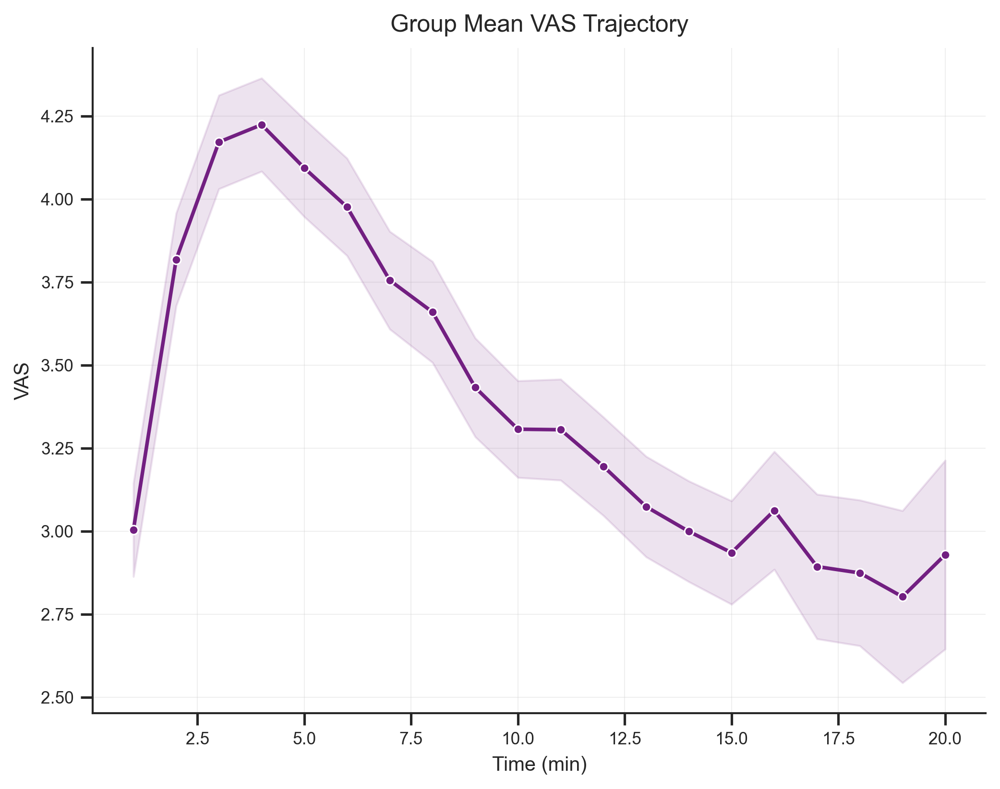

*图注：* 图中显示口服辣椒素后 20 分钟观察期内群体平均 VAS 轨迹，误差表示 SEM。

*缩写：* SEM，均值标准误；VAS，视觉模拟评分。

**图 2. 时间疼痛表型轨迹。**

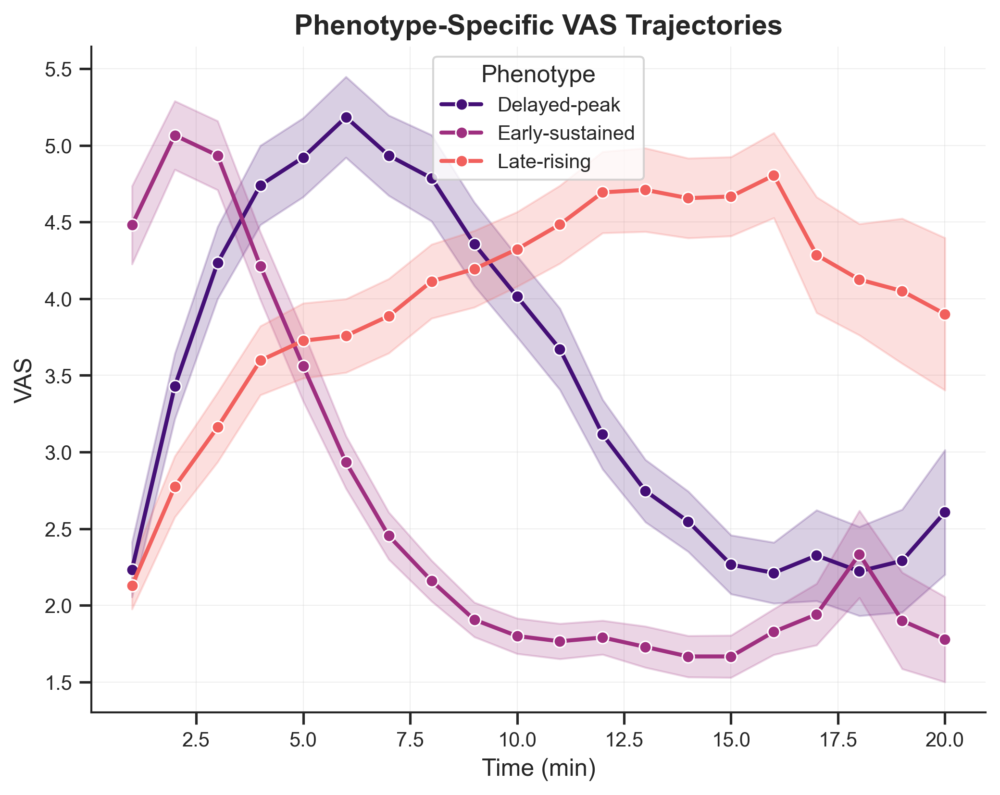

*图注：* 图中显示按 DTW 推导时间表型分层的平均 VAS 轨迹，误差表示 SEM。

*缩写：* DTW，动态时间规整；SEM，均值标准误；VAS，视觉模拟评分。

平均 VAS 评分在前 2-4 分钟内迅速升高，于第 4 分钟达到峰值 4.22，随后逐渐下降，但在整个观察期间仍高于 0。该轨迹反映双相疼痛反应。图中展示的变点和时间事件分析显示，阈值定义的中位起始时间为 1.0 分钟，导数定义的中位起始时间为 2.0 分钟，PELT 变点众数位于第 5 分钟，中位缓解时间为 5.0 分钟。群体 AUC 为 64.56，反映累积疼痛负荷。

### 3.3 聚类分析

基于 DTW 的聚类识别出三种时间模式：聚类 1/延迟达峰反应者（n=77）表现为延迟达峰后逐渐下降；聚类 2/早期持续反应者（n=77）表现为早期升高并维持中等强度；聚类 3/晚期上升反应者（n=62）表现为逐渐升高并在晚期保持较高水平。三聚类方案的平均轮廓系数为 0.318，提示中等分离度。图 11 所示的 shapelet 分析识别出聚类特异性局部模式，支持对这些表型的解释。

### 3.4 症状分布与网络分析

**图 3. 症状负荷。**

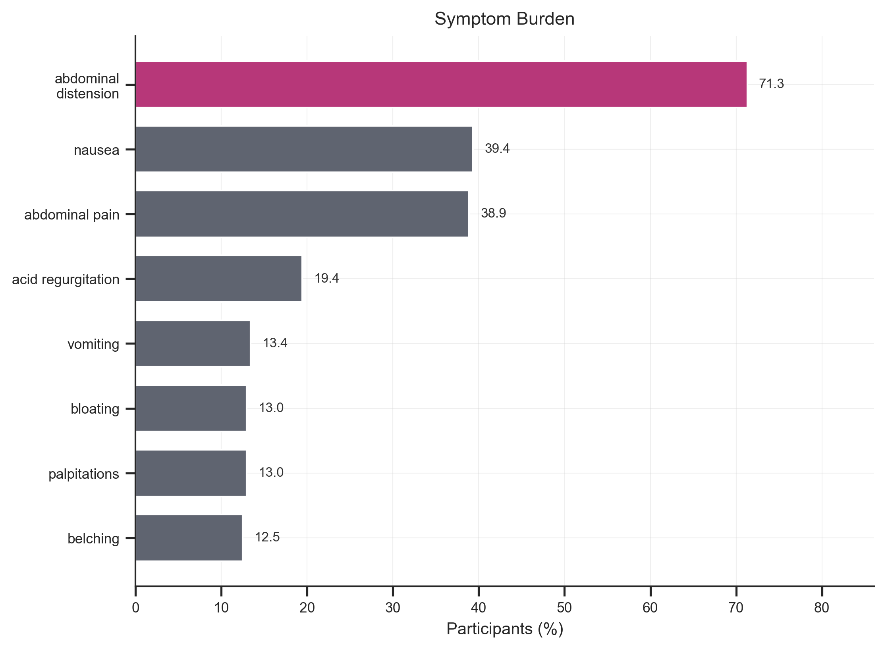

*图注：* 图中显示辣椒素给药后参与者报告的胃肠道症状频率。

*缩写：* GI，胃肠道。

**图 4. 疼痛区域负荷。**

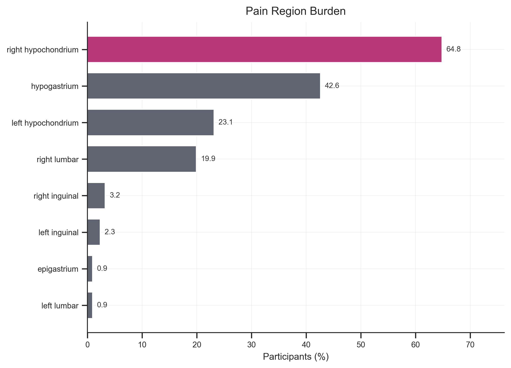

*图注：* 图中显示症状报告的解剖区域频率。

*缩写：* 无。

腹部膨隆/胀满是最常见症状（154/216，71.3%），其次为恶心（85/216，39.4%）和腹痛（84/216，38.9%）。症状主要定位于右季肋区（140/216，64.8%）和下腹部/耻骨上区（92/216，42.6%）。共现热图见图 12 和图 13。

总体症状-区域网络显示出结构化关联。最强边为腹部膨隆/胀满-右季肋区（权重=110）。右季肋区加权度最高（368），是主要区域枢纽，其次为下腹部/耻骨上区（加权度=267）。Rome IV 对齐映射中，胆道痛样模式最常见（57/216，26.4%），其次为功能性腹胀/腹部膨隆样（35/216，16.2%）和 IBS 样模式（25/216，11.6%）。

### 3.5 短期方向预测

**图 5. 早期 VAS 窗口表型分类。**

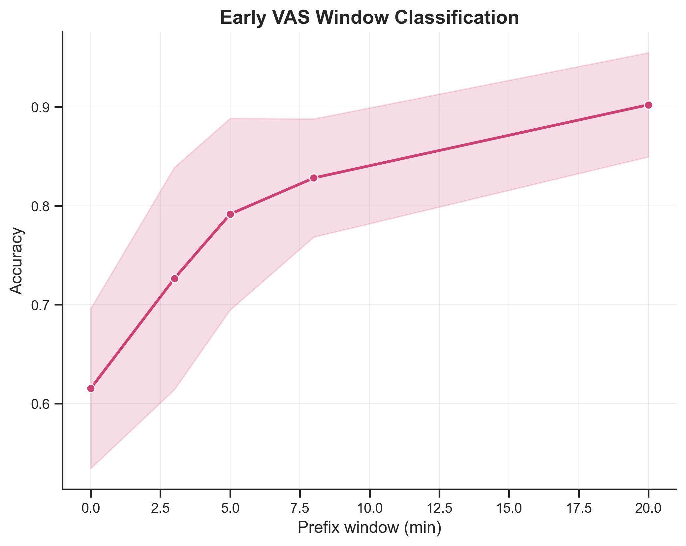

*图注：* 图中显示纳入逐渐更长的早期 VAS 窗口时，受试者层面时间表型分类准确率。

*缩写：* VAS，视觉模拟评分。

**图 6. 基线和生理特征表型预测。**

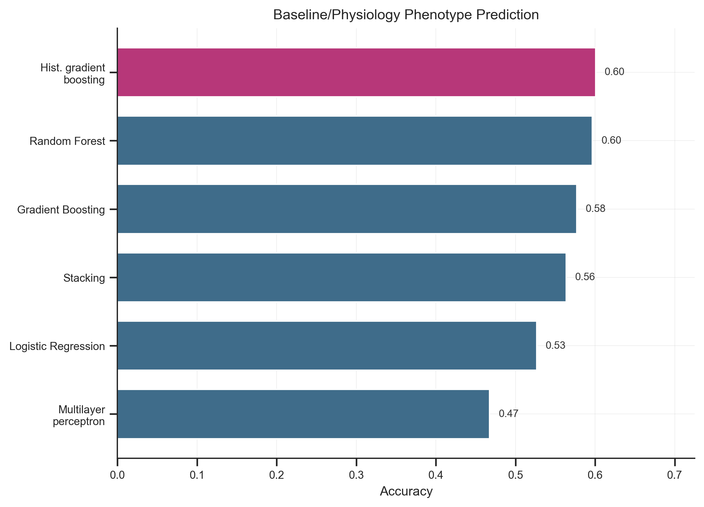

*图注：* 图中显示基于基线人口学、问卷、ECG 和 EGG 特征预测时间表型归属的交叉验证准确率。

*缩写：* ECG，心电图；EGG，胃电图。

随着纳入更多早期 VAS 信息，时间表型分类表现提高。不使用辣椒素后 VAS 轨迹信息时，分类准确率为 0.500；使用 8 分钟和 20 分钟窗口时，准确率分别达到 0.727 和 0.811。相比之下，仅使用基线人口学、问卷、ECG 和 EGG 特征进行预测的表现有限；最佳模型为随机森林，准确率为 0.495，平衡准确率为 0.498。

VAS 变化短期方向预测见图 14 和表 4。逻辑回归模型达到 0.711 的平衡准确率和 0.687 的 macro F1 分数，优于多数类和持续性基线模型。

### 3.6 基于基线特征的表型预测

**图 7. 按表型分层的年龄分布。**

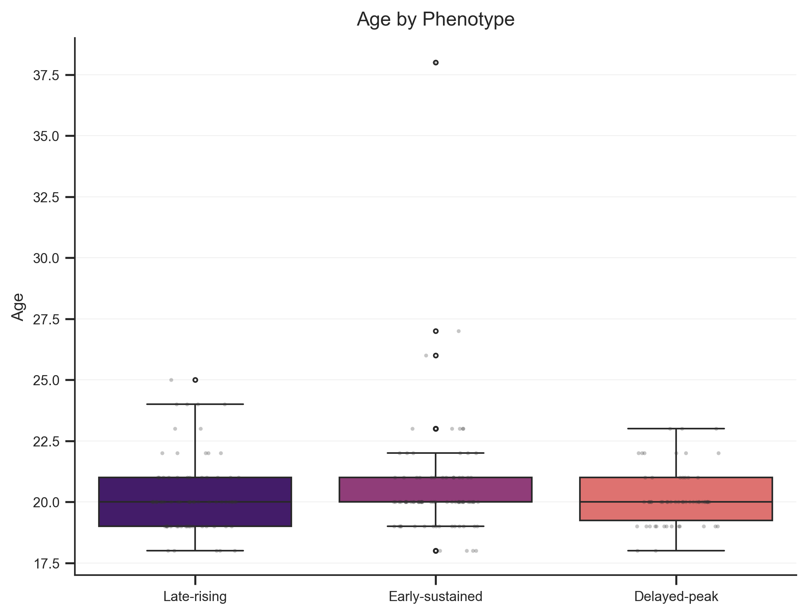

*图注：* 图中显示按时间表型分层的年龄分布。

*缩写：* 无。

**图 8. 标准化 ECG/EGG 特征分布。**

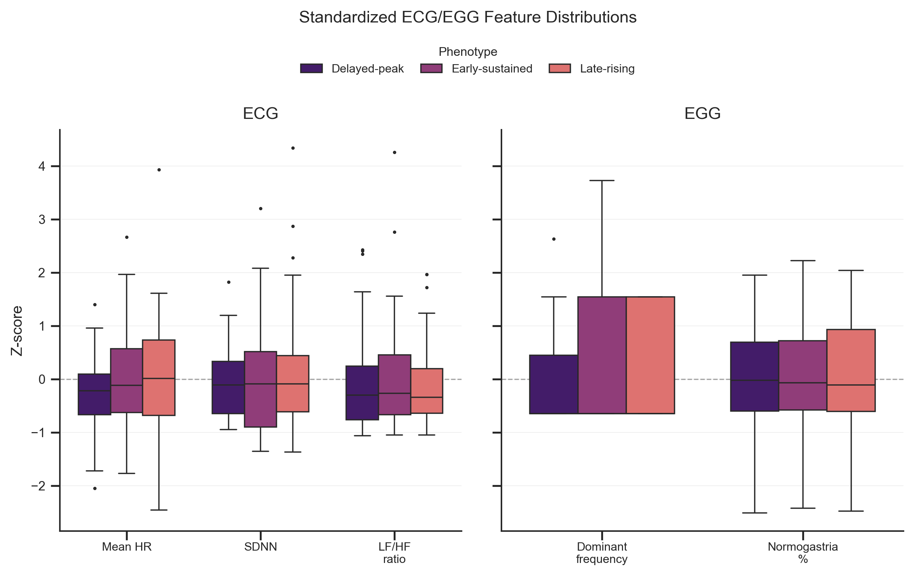

*图注：* 图中显示按时间表型分层的标准化 ECG/EGG 特征分布。

*缩写：* ECG，心电图；EGG，胃电图。

基线人口学和生理变量在不同时间表型之间仅表现出弱分离。仅基于 ECG/EGG 的表型预测同样有限；表现最佳的 ECG/EGG 模型为随机森林，准确率为 0.500，平衡准确率为 0.498。特征重要性和混淆矩阵摘要见图 15 和图 16。这些结果表明，在当前数据集中，测量到的基线特征和可用生理特征并不能强有力地决定时间表型归属。

### 3.7 疼痛起始检测

#### 3.7.1 群体水平 VAS 轨迹

为表征疼痛强度的群体水平动态，绘制口服辣椒素后 20 分钟内的 VAS 评分，误差线表示均值标准误（SEM），并叠加各时间点样本量直方图。

平均 VAS 评分在前 2-4 分钟内迅速升高，于第 4 分钟达到峰值 4.22，提示辣椒素暴露后不适感快速出现。峰值后，评分从第 5 分钟至第 15 分钟逐渐下降，并稳定在约 3.0。该轨迹反映双相疼痛反应：急性上升阶段之后为逐渐适应或脱敏阶段。

垂直直方图条显示，随时间推移，贡献观测值的参与者数量减少，尤其是在第 15 分钟后，这与编码为 "E" 或 "T" 的提前或技术性终止标记有关。尽管可用观测值减少，总体下降趋势仍清晰可见。

#### 3.7.2 变点分析

为补充阈值法起始定义，本研究使用变点检测识别 VAS 序列分布特征发生突变的时间点。采用基于秩的 PELT 算法，惩罚参数为 0.5。

分析基于 216 条辣椒素摄入后的个体 VAS 时间序列。每名参与者的变点独立检测，结果分布见图 9。

**图 9. 起始和变点时间。**

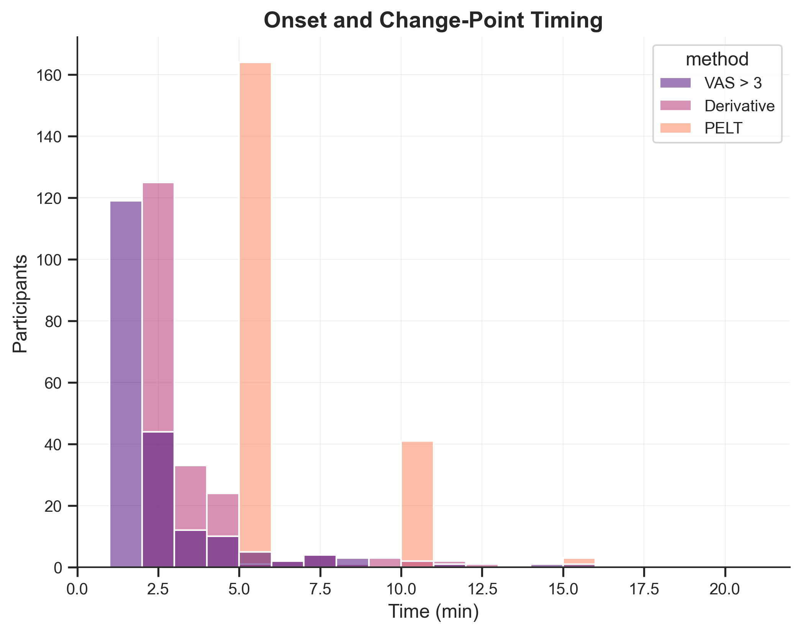

*图注：* 本图总结辣椒素给药后个体 VAS 轨迹中阈值定义起始、导数定义起始和 PELT 推导变点的时间分布。

*缩写：* PELT，Pruned Exact Linear Time；VAS，视觉模拟评分。

检测到的多数变点聚集于时间索引 5（对应暴露后第 5 分钟），超过 40 名受试者在该时间点表现出疼痛轨迹变化。较少见的附加聚集出现在索引 10（第 10 分钟）和索引 15（第 15 分钟），分别影响 11 名和 4 名受试者。其他时间窗内很少或未检测到变点。

这一时间模式与群体 VAS 轨迹一致：疼痛强度在前 4-5 分钟快速升高，于第 4-5 分钟左右达峰，随后逐渐下降。早期变点集中反映疼痛由上升阶段转入下降阶段，而较晚变点可能对应个体反应中的次级转换或缓解阶段。

使用基于秩的代价函数可实现稳健的非参数分段，对离群值和不规则方差不敏感，因此特别适合主观疼痛评分等异质性生理数据。

### 3.8 生存分析

Kaplan-Meier 生存曲线使用 lifelines Python 包计算。中位生存时间和 95% 置信区间使用 Greenwood 公式估计。为评估起始与缓解阶段之间的时间关系，使用 log-rank 检验（α=0.05）比较疼痛起始时间和疼痛缓解时间分布，该检验用于评估同一队列内两类事件是否遵循不同的时间事件分布。

为刻画辣椒素诱导疼痛的时间模式，本研究对两个事件进行 Kaplan-Meier 生存分析：（1）疼痛起始，定义为 VAS 评分首次超过 3；（2）疼痛缓解，定义为峰值后 VAS 评分首次降至 1 以下。共纳入 216 名参与者，VAS 评分在 20 分钟观察期内每 1 分钟采集一次。

如图 10 所示，VAS > 3（疼痛起始）的生存曲线在早期分钟迅速下降。中位起始时间为 1.0 分钟，提示辣椒素暴露后很快感知到不适。相比之下，VAS < 1（疼痛缓解）的生存曲线呈延迟且逐渐下降，中位缓解时间为 5.0 分钟。

**图 10. 起始和缓解的 Kaplan-Meier 事件曲线。**

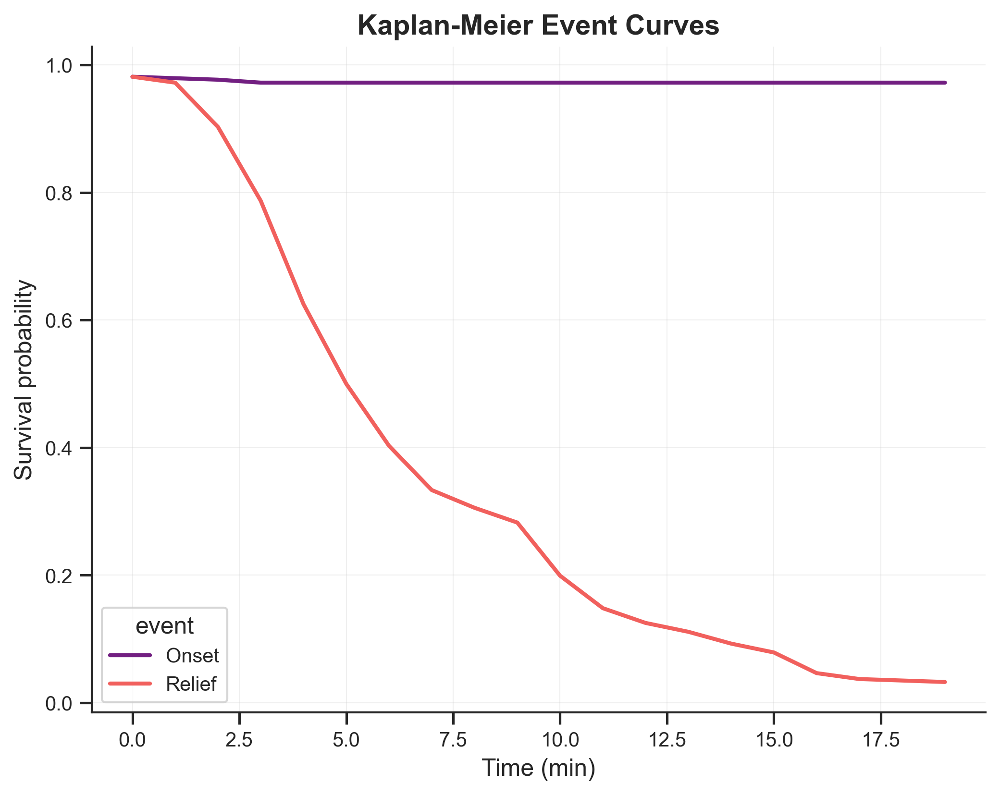

*图注：* Kaplan-Meier 曲线显示口服辣椒素后疼痛起始和疼痛缓解的时间，可比较起始和缓解阶段。

*缩写：* KM，Kaplan-Meier；VAS，视觉模拟评分。

Log-rank 检验支持起始和缓解分布之间存在差异（p < 0.0001），反映初始疼痛上升与后续缓解阶段之间存在时间分离。这种双相轨迹支持辣椒素模型适合捕捉急性伤害感受激活和后续脱敏或适应。

### 3.9 疼痛暴露量化

疼痛强度 AUC 用于量化整个 20 分钟观察期内疼痛强度和持续时间的综合暴露。AUC 单位为 VAS·时间（分钟），数值越高表示受试者经历的累积疼痛越大。排除 'E'/'T' 标记后，每 1 分钟计算群体平均 VAS 评分。AUC 使用 numpy.trapezoid 计算。峰值 VAS 强度和峰值时间使用 numpy.nanmax 和索引映射提取。

为量化辣椒素暴露后的总体疼痛体验，本研究分析 216 名参与者的群体平均 VAS 轨迹（图 1）。VAS 数据经预处理以处理删失事件（如提前终止），并在计算中排除标记为 'E' 或 'T' 的值。

平均 VAS 在前 4 分钟迅速升高，于第 4 分钟达到峰值 4.22，随后逐渐下降。疼痛反应持续贯穿整个 20 分钟观察窗，群体水平 VAS 非零值维持 19 分钟，提示症状阶段较长。

AUC 反映队列累积疼痛负荷，使用梯形法计算为 64.56。该指标整合疼痛幅度和持续时间，可能是组间比较或治疗效果评估的稳健结局指标。

观察到的疼痛轨迹呈现口服辣椒素模型典型双相特征：急性不适起始后逐渐脱敏。该模式确认了该模型在群体层面捕捉动态伤害感受过程的实用性。

### 3.10 聚类分析

为根据 VAS 时间序列形态对受试者分组，并依据疼痛曲线的动态形态识别典型疼痛反应模式，本研究采用时间序列形状聚类方法。由于峰值疼痛强度出现时间可能因受试者而异，直接计算逐点欧氏距离可能低估形态相似性。因此，采用 DTW 距离作为时间序列之间的距离度量。DTW 允许沿时间轴进行灵活对齐，即使两条曲线存在时间错位，也可匹配相似形态成分。

K-means 聚类（DTW 版本）：使用 DTW 距离替代欧氏距离，并在聚类过程中使用 DBA 算法计算聚类中心（平均曲线）。该方法可迭代优化得到 K 个聚类；每个聚类的中心曲线代表一种典型疼痛模式。

为处理 VAS 时间序列中的不规则终止模式，标记为 "E"（提前终止）或 "T"（技术性终止）的值被视为删失。一旦任一时间点出现 E 或 T 标记，该参与者后续所有测量值均设为缺失（NaN），从而有效移除终止后的数据。缺失值在每项运算中排除（如均值、标准差）。

使用 DTW 和 DBA 的时间序列聚类识别出三种不同的疼痛轨迹时间模式。每条曲线表示一个聚类中心（原型），概括该组受试者疼痛强度的特征性时间演化。聚类 1（n=77）表现为延迟达峰后逐渐下降（延迟达峰反应者）；聚类 2（n=77）表现为早期上升并维持中等强度（早期持续反应者）；聚类 3（n=62）表现为逐渐升高并在晚期抬高（晚期上升反应者）。这些模式提示个体疼痛反应存在异质性时间动态。

每个聚类中个体的轮廓系数基于成对 DTW 距离展示。多数样本轮廓值为正，提示聚类分配适当。虚线表示平均轮廓系数（0.318），反映中等但有意义的聚类分离。

三聚类方案（K=3）的平均轮廓系数使用成对 DTW 距离计算。0.318 的轮廓值提示中等但有意义的聚类分离。作为比较，还考察了 K=2 至 K=6 的候选聚类方案，K=3 显示最高轮廓值，与主分析中的三聚类结构一致。

为考虑聚类分配不确定性，本研究还进行了基于 DTW 的模糊聚类。由于传统模糊 c-means 假设欧氏几何，本研究采用基于 DTW 的模糊 c-medoids 算法，为每名受试者分配其属于每个聚类的隶属度。模糊参数设为 m=2，聚类数与主分析相同（K=3）。

基于 DTW 的疼痛轨迹模糊聚类识别出三种代表性时间模式。每条曲线对应一个聚类的 medoid 轨迹，代表该组中最中心的受试者。更新分析的最终硬标签分布为 77、77 和 62 名参与者，分别对应三个时间表型。这些结果提示受试者疼痛反应具有异质性时间动态。

DTW 模糊 c-medoids 聚类所得各聚类隶属度直方图显示，多数受试者具有中等隶属度（0.2-0.5），提示其与多个聚类存在部分关联。这说明疼痛反应模式更像连续谱，而非严格离散类别。

目标函数在前几次迭代中迅速下降，随后趋于稳定，提示算法有效收敛到稳定解。未观察到振荡或发散，支持聚类过程稳健。

总体而言，这些结果提示时间疼痛反应更适合作为部分重叠模式的连续谱来表征，而非严格离散类别。

### 3.11 特征提取

为提高聚类结果的可解释性，本研究提取 shapelets 作为每种时间表型的代表性局部子序列。这些子序列识别出最能将某个聚类与其余序列区分开的轨迹片段，并为每种反应模式提供局部特征签名。

Shapelet 分析揭示了进一步阐明疼痛表型结构的聚类特异性时间模式（图 11）。聚类 1 的 shapelets 反映延迟达峰及随后下降；聚类 2 表现为持续或平台样模式；聚类 3 的 shapelets 反映信号强度逐渐增加，与延迟或累积反应一致。这些发现提示观察到的聚类结构由不同局部时间动态驱动，而非仅由整体幅度差异驱动。

**图 11. 聚类特异性 shapelets。**

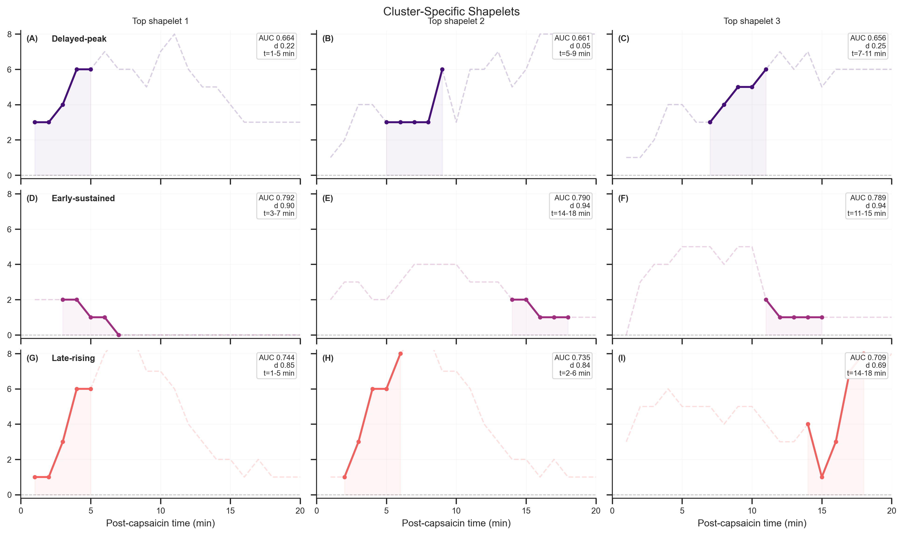

*图注：* 可区分聚类的 shapelets 展示了区分延迟达峰、早期持续和晚期上升 VAS 反应表型的局部时间模式。

*缩写：* VAS，视觉模拟评分。

这些结果提示，疼痛反应不仅由峰值强度定义，也由反应阶段的时间组织定义，包括起始速度、持续性和恢复动态。

### 3.12 症状数据编码与预处理

参与者报告的胃肠道症状使用预定义编码系统记录，其中每种症状由一个大写字母（A-L）表示，每个解剖区域由数字代码（1-9）表示。症状代码对应标准化症状描述（如腹痛、烧心、恶心），区域代码表示腹部拓扑区域（如上腹部、脐周、下腹部）。

为保证下游分析一致性，编码条目采用字符层面解码策略解析。具体而言，紧凑表示（如 "12"）被拆分为单个代码（["1", "2"]），带分隔符的混合格式（如 "1;2"、"A/C"）通过去除分隔符并拆分为单字符标记进行标准化。无效或未定义代码根据预定义代码本排除。在每名参与者内，重复代码被移除，同时保留原始出现顺序。

解码后的症状和区域代码随后使用预定义字典映射为相应标准化文本标签。该过程为每名参与者生成结构化的标准化症状和解剖区域列表，用于定量分析。

### 3.13 症状-区域关联构建

在参与者层面构建症状-区域关系的二部表示。对每名个体，生成其报告症状与解剖区域之间所有两两组合。为减少受试者内冗余，重复症状-区域对被折叠为每名参与者一次出现。

在全队列中聚合这些两两关联，形成加权症状-区域矩阵，其中每个单元格表示给定症状与给定解剖区域的共现频率。该矩阵作为后续网络和热图分析基础。

对辣椒素诱导实验期间收集的症状描述进行描述性统计和共现分析，以总结常见症状类别及其解剖分布。

共分析 216 条症状报告，用于表征辣椒素诱导内脏感觉在解剖区域中的分布。总体而言，腹部膨隆/胀满是最常报告的症状（154/216，71.3%），其次为恶心（85/216，39.4%）和腹痛（84/216，38.9%）。其他症状，包括反酸、呕吐、腹胀感、心悸和嗳气，报告频率较低。

症状感知主要定位于右季肋区（140/216，64.8%）和下腹部/耻骨上区（92/216，42.6%），其次为左季肋区和右腰区。在当前编码数据集中，腹股沟、上腹部和脐周区域报告较少。

共现热图进一步显示区域特异性症状模式（图 12）。右季肋区和下腹部/耻骨上区具有最密集的症状共现计数，尤其涉及腹部膨隆/胀满、恶心和腹痛。这些模式应解释为由参与者报告的症状和区域代码推导出的共现结构，而非直接解剖定位。

**图 12. 症状-区域共现热图。**

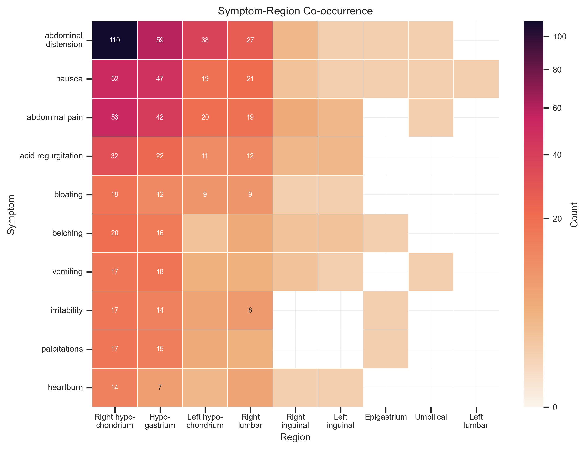

*图注：* 热图显示辣椒素给药后参与者层面的报告症状类别与解剖区域之间的共现计数。

*缩写：* 无。

某些区域（如右腹股沟区）由于样本计数有限而呈现稀疏但高度特异的症状模式，应谨慎解释。总体而言，这些结果提示辣椒素诱导感觉并非随机分布，而是表现出与结构化内脏感觉组织一致的空间-症状耦合模式。

所有分析均基于共现扩展，即单名参与者报告的多个症状和多个区域被纳入所有可能组合。因此，热图反映相对共现模式，而非一对一症状-区域对应关系。

### 3.14 共现网络分析

共现网络分析用于表征症状类别和解剖区域之间的结构关系。节点表示症状或腹部区域，边表示参与者内共现。边权重对应报告成对特征共现的参与者人数。共现统计直接来自实验数据集而无外部先验，因此密集局部子网络应解释为反复出现的感知模式，而非解剖通路。

总体二部共现网络显示出高度结构化的症状-区域关联模式。最强边为腹部膨隆/胀满与右季肋区（权重=110），提示腹部膨隆/胀满主要定位于右上腹区域。次强关联为腹部膨隆/胀满与下腹部/耻骨上区（权重=59），随后为腹痛与右季肋区（权重=53）。

其他显著关联包括恶心与右季肋区（权重=52）以及恶心与下腹部/耻骨上区（权重=47）。这些发现共同提示，在当前编码数据集中，多种症状形式汇聚于右季肋区和下腹部/耻骨上区。

节点水平分析进一步显示，右季肋区加权度最高（368），是网络中的主要枢纽。其次为下腹部/耻骨上区（267）、腹部膨隆/胀满（240）、恶心（145）和腹痛（143）。

总体而言，网络结构提示症状组织具有集中化特征，以右季肋区为主要枢纽，并伴有下腹部/耻骨上区及相邻区域的次级参与。多条高权重边向这些区域汇聚，支持存在结构化上腹部感觉轴，与辣椒素刺激的预期生理反应一致。

**表 2. 总体症状-区域网络前 5 个症状-区域关联**

| 症状 | 区域 | 权重 |
|---|---|---:|
| 腹部膨隆/胀满 | 右季肋区 | 110 |
| 腹部膨隆/胀满 | 下腹部/耻骨上区 | 59 |
| 腹痛 | 右季肋区 | 53 |
| 恶心 | 右季肋区 | 52 |
| 恶心 | 下腹部/耻骨上区 | 47 |

**表 3. 总体症状-区域网络前 5 个网络节点**

| 节点 | 类型 | 度 | 加权度 |
|---|---|---:|---:|
| 右季肋区 | 区域 | 12 | 368 |
| 下腹部/耻骨上区 | 区域 | 12 | 267 |
| 腹部膨隆/胀满 | 症状 | 8 | 240 |
| 恶心 | 症状 | 9 | 145 |
| 腹痛 | 症状 | 7 | 143 |

### 3.15 基于 Rome IV 的症状模式映射

基于 Rome IV 标准，使用规则评分框架将参与者层面的症状谱映射到 FGID 类别。对于每个 FGID 类别，诊断规则根据必需症状、支持症状、必需解剖区域和支持解剖区域定义。该过程代表与 Rome IV 定义类别的症状层面对齐，而非正式临床诊断。

#### 3.15.1 症状-区域关联

症状-区域频率矩阵分析显示，胃肠道症状存在非均匀空间分布。右季肋区是最主要的解剖位置，在多个症状中均表现出最高关联频率，尤其是腹部膨隆/胀满、恶心和腹痛。下腹部/耻骨上区也表现出显著参与。相比之下，在当前编码数据集中，腹股沟、上腹部和脐周区域症状较少。

#### 3.15.2 症状-疾病映射

症状谱到 Rome IV 对齐类别的映射显示出不同关联模式（图 13）。腹部膨隆/胀满和腹痛广泛贡献于胆道痛样、腹胀/膨隆样和 IBS 样对齐。恶心和呕吐贡献于上消化道症状模式对齐，而腹胀感和腹部膨隆/胀满主要与功能性腹胀/腹部膨隆样模式相关。

**图 13. 症状-Rome IV 共现热图。**

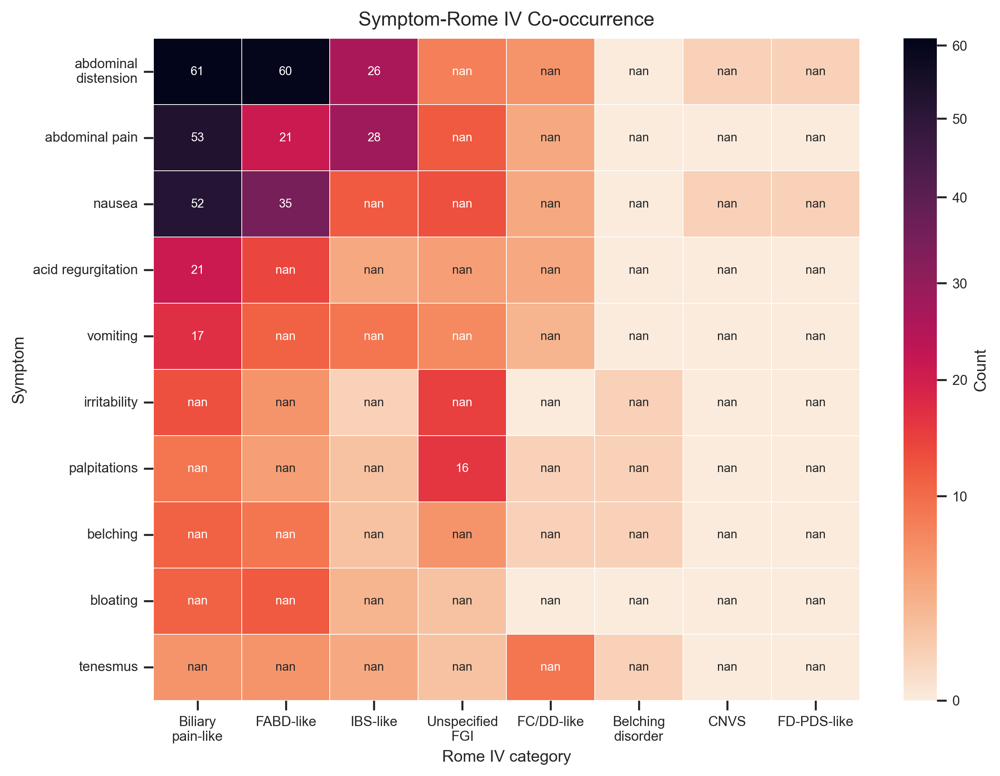

*图注：* 热图显示报告症状类别与规则映射框架生成的 Rome IV 对齐症状模式之间的关联。

*缩写：* FGID，功能性胃肠病。

#### 3.15.3 区域-疾病关系

整合解剖信息显示，疾病关联具有强烈区域依赖性。右季肋区在多个 Rome IV 对齐症状模式类别中连通性最高，尤其是胆道痛样和腹胀/腹部膨隆样对齐。下腹部/耻骨上区与 IBS 样和腹胀相关条件存在中等关联。包括腹股沟区在内的下腹部区域关联较弱但更具特异性。

#### 3.15.4 网络层面整合

三部网络分析揭示了连接症状、解剖区域和疾病类别的密集互联结构。症状-区域关联形成以右季肋区和下腹部/耻骨上区为中心的紧密模块，并与胆道痛样、腹胀/腹部膨隆样和 IBS 样症状模式对齐相关。低频症状表现出更分散的连接模式和较弱类别特异性。

该网络还突出显示多个疾病类别之间症状贡献的重叠，反映 FGID 固有的异质性和共享症状学。

#### 3.15.5 FGID 类别分布

在队列水平，胆道痛样谱最常见（26.4%，57/216），其次为功能性腹胀/腹部膨隆样（16.2%，35/216）、IBS 样（11.6%，25/216）、未特指功能性 GI 症状模式（5.1%，11/216）、功能性便秘/排便障碍样（2.3%，5/216）和功能性消化不良-PDS 样（0.5%，1/216）。

### 3.16 短期方向预测

为评估症状动态的短期可预测性，本研究采用滑动窗口分类框架预测下一时间点 VAS 评分是否下降。

对每名参与者，将连续 VAS 时间序列（1-20 分钟）分割为长度为 3 的重叠窗口。每个窗口使用前三个观测值 [VAS_{t-2}, VAS_{t-1}, VAS_t] 预测下一时间点的变化方向。

主要结局定义为一个二分类变量，表示下一分钟 VAS 评分是否下降：

$$y = \begin{cases} 1, & \text{if } VAS_{t+1} < VAS_t \\ 0, & \text{otherwise} \end{cases}$$

特征输入包括窗口内近期 VAS 值、局部斜率（3 点窗口上最小二乘线性回归斜率）、时间索引（分钟）、局部汇总统计量（均值、标准差、范围）、到局部极值（最大/最小）的距离、窗口内单调性指标和受试者层面表型特征（平均 VAS 和聚类标签）。分类变量进行独热编码。

为避免重复测量之间的信息泄漏，模型评估采用组内交叉验证，同一参与者的所有样本分配到同一折。

评估三种模型：（1）多数类分类器（预测最常见类别），（2）持续方向模型（基于当前斜率预测下一方向），（3）带类别平衡的逻辑回归模型。

模型表现使用准确率、平衡准确率、macro F1 和 weighted F1 评估。由于类别不平衡，重点关注平衡准确率和 macro F1。

**图 14. 短期 VAS 方向分类性能。**

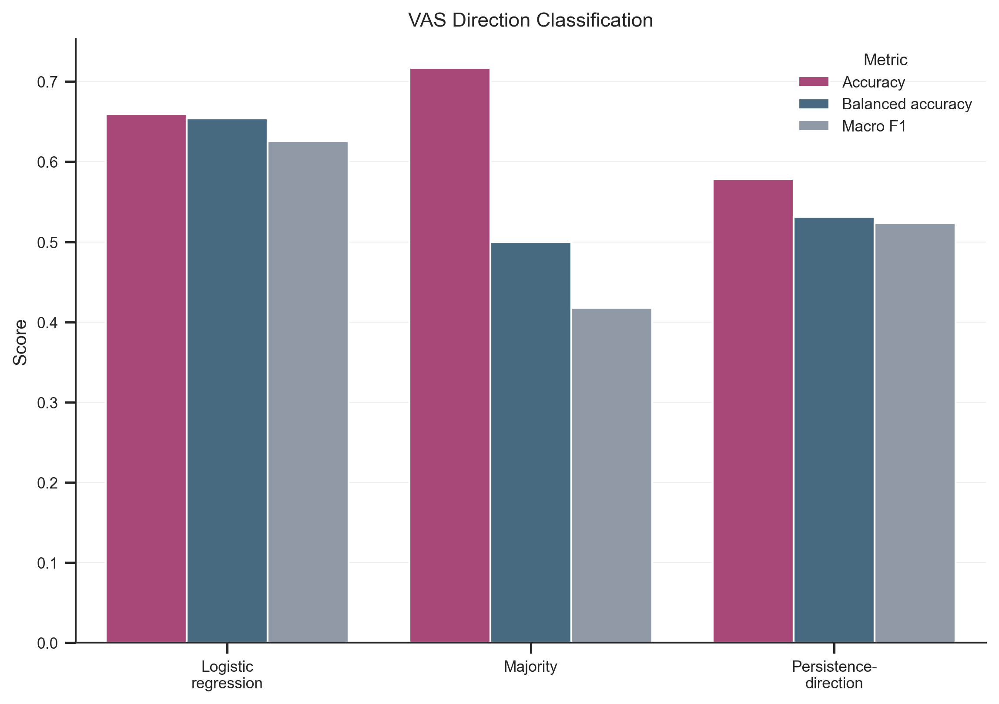

*图注：* 图中比较多数类、持续方向和逻辑回归模型在预测下一 VAS 值是否下降方面的分类性能。

*缩写：* VAS，视觉模拟评分。

**表 4. 短期方向预测模型性能**

| 模型 | 准确率（均值 ± SD） | 平衡准确率 | Macro F1 | Weighted F1 |
|---|---:|---:|---:|---:|
| Majority | 0.717 ± 0.016 | 0.500 ± 0.000 | 0.418 ± 0.005 | 0.599 ± 0.021 |
| PersistenceDir | 0.579 ± 0.032 | 0.531 ± 0.025 | 0.523 ± 0.025 | 0.594 ± 0.031 |
| Logistic | 0.722 ± 0.030 | 0.711 ± 0.016 | 0.687 ± 0.022 | 0.732 ± 0.026 |

在组内交叉验证中，逻辑回归模型相较基线模型表现更优，平衡准确率为 0.711，macro F1 为 0.687。相比之下，多数类分类器总体准确率较高（0.717），但无法识别下降转换（平衡准确率=0.500），反映类别不平衡。

基于持续性的模型根据当前斜率预测下一方向，表现中等（平衡准确率=0.531）。

逻辑回归模型提高了对下降转换的检测，对下降类别获得更高召回率。该发现提示，从近期轨迹模式可部分预测进入恢复阶段。

与此前三状态方向预测方法相比，二分类下降转换预测表现更好。在当前数据集中，恢复相关动态较细粒度方向波动表现出更强局部可预测性。

### 3.17 基于基线特征的表型预测

为评估是否可由实验前特征预测 DTW 聚类识别的时间疼痛表型，本研究训练六种分类器，使用基线人口学、问卷、ECG 和 EGG 数据预测聚类归属。

在观察数据集上进行分层十折交叉验证时，没有模型达到强预测性能。随机森林达到最高准确率（0.495 ± 0.071）和平衡准确率（0.498 ± 0.073），其次为梯度提升（准确率=0.473；平衡准确率=0.466）和 stacking（准确率=0.453；平衡准确率=0.463）。

**表 5. 基于基线和生理特征的表型预测**

| 模型 | 准确率（均值 ± SD） | 平衡准确率 | Macro F1 | Weighted F1 |
|---|---:|---:|---:|---:|
| Logistic Regression | 0.384 ± 0.110 | 0.388 ± 0.107 | 0.369 ± 0.100 | 0.367 ± 0.102 |
| Random Forest | 0.495 ± 0.071 | 0.498 ± 0.073 | 0.490 ± 0.081 | 0.490 ± 0.079 |
| Gradient Boosting | 0.473 ± 0.098 | 0.466 ± 0.095 | 0.459 ± 0.098 | 0.462 ± 0.099 |
| HistGradientBoosting | 0.444 ± 0.095 | 0.440 ± 0.093 | 0.438 ± 0.097 | 0.439 ± 0.098 |
| MLP | 0.291 ± 0.079 | 0.309 ± 0.061 | 0.235 ± 0.099 | 0.227 ± 0.111 |
| Stacking | 0.453 ± 0.047 | 0.463 ± 0.053 | 0.450 ± 0.046 | 0.445 ± 0.044 |

对于近似平衡的三分类问题，机会水平平衡准确率为 0.333。ECG/EGG 特征重要性和混淆矩阵分析见图 15 和图 16。

**图 15. ECG/EGG 随机森林特征重要性。**

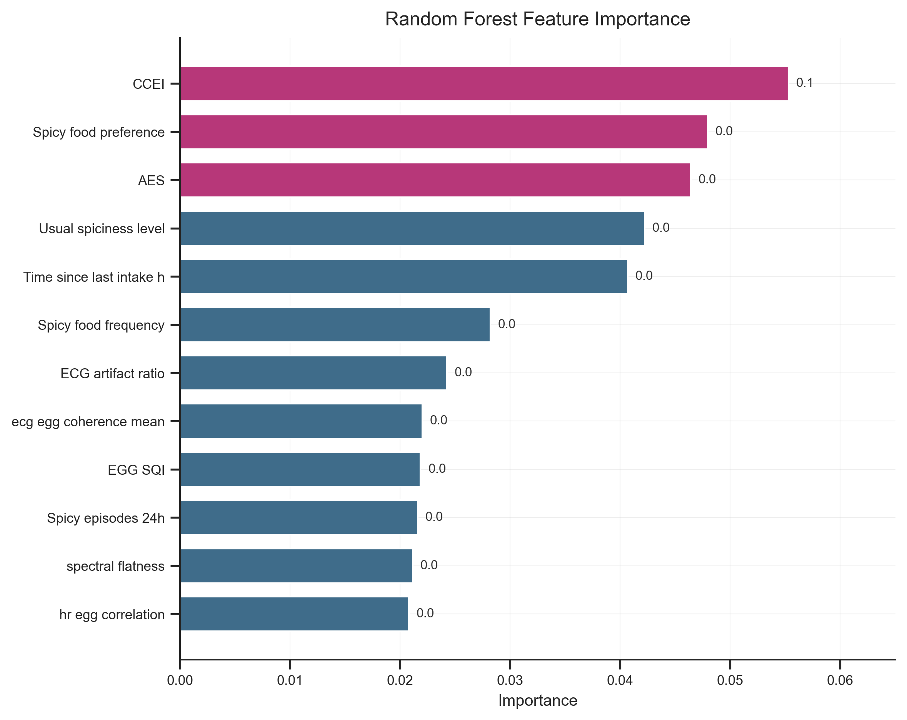

*图注：* 随机森林特征重要性值总结 ECG、EGG 和 ECG-EGG 耦合特征对时间表型预测的相对贡献。

*缩写：* ECG，心电图；EGG，胃电图。

**图 16. ECG/EGG 表型预测混淆矩阵。**

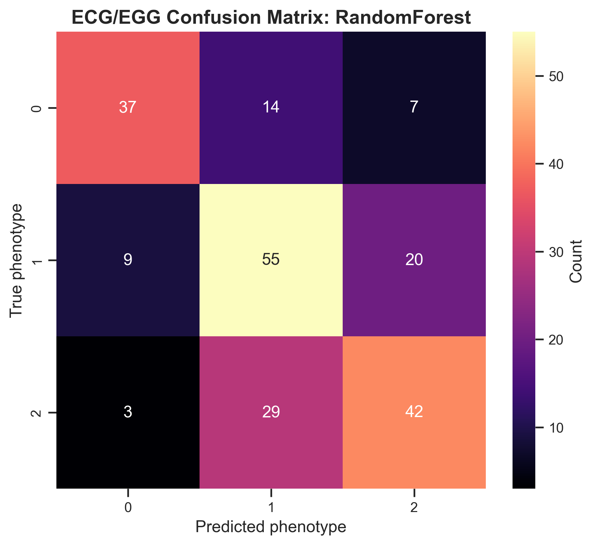

*图注：* 混淆矩阵显示基于 ECG/EGG 的分类模型对时间表型的折外预测。

*缩写：* ECG，心电图；EGG，胃电图。

这些观察数据结果表明，时间疼痛表型并不由已测量的实验前人口学特征、饮食习惯、基线症状谱、HRV 参数或 ECG-EGG 耦合指标强烈决定。

### 3.18 安全性与不良事件

研究期间未发生不良事件或严重不良事件。无参与者因安全问题需要医学干预、计划外临床照护、住院或中止方案。辣椒素诱导的预期短暂胃肠感觉作为研究结局记录，除非超过预期反应谱或需要临床处理，否则不归类为不良事件；本研究未观察到此类事件。

**表 6. 不良事件摘要**

| 安全结局 | 参与者人数 | 百分比 |
|---|---:|---:|
| 任何不良事件 | 0 | 0.0% |
| 严重不良事件 | 0 | 0.0% |
| 需要医学干预 | 0 | 0.0% |
| 因不良事件中止方案 | 0 | 0.0% |
| 住院 | 0 | 0.0% |

预期的短暂辣椒素诱导胃肠感觉作为研究结局分析，除非需要临床干预、导致方案中止或超过预期反应谱，否则不归类为不良事件。

## 4. 讨论

本研究使用口服辣椒素诱导内脏痛模型，表征实验诱发上消化道不适在时间、空间和症状层面的组织结构。主要发现包括：辣椒素产生可重复的双相 VAS 轨迹；个体反应可概括为部分重叠的时间表型；症状-区域关联主要汇聚于右季肋区；Rome IV 映射识别出胆道痛样、腹胀/腹部膨隆样和 IBS 样症状模式，但这些模式并不构成正式诊断；短期恢复转换具有有限但可测量的可预测性；时间表型归属仅能由已测量的基线人口学、问卷、ECG 和 EGG 特征弱预测。

疼痛的快速起始和逐渐缓解与 TRPV1 激活已知的兴奋和脱敏特性一致。疼痛起始中位时间为 1.0 分钟，缓解中位时间为 5.0 分钟，反映初始疼痛上升与后续缓解阶段之间清晰的时间分离。快速起始可能反映辣椒素暴露后伤害感受器即时激活，而逐渐缓解可能涉及钙依赖性脱敏过程和下行抑制通路激活。然而，本研究未纳入自主神经、神经影像或分子测量，因此个体时间表型的生物学机制仍属推断。基于秩的变点检测（PELT 算法）提供了客观时间标志，多数变点聚集于第 5 分钟，对应疼痛由上升阶段转入下降阶段。

聚类分析显示，个体反应存在异质性，可分为不同时间表型，包括延迟达峰、早期持续和晚期上升模式。这些时间表型不应解释为固定临床亚型。相反，模糊聚类结果提示辣椒素诱导疼痛反应处于连续谱上，个体在疼痛感知的时间、持续性和恢复模式上存在差异。AUC、峰值 VAS 和平均 VAS 等传统汇总指标会丢失这种时间形态信息，而基于 DTW 的聚类可在峰值时间不同的情况下捕捉形态相似性。Shapelet 分析进一步通过识别区分聚类的时间局部模式增强了解释性。这些发现与近期 FGID 分型研究相一致，后者通过症状严重度谱的非线性聚类识别出不同患者聚类 [22]。这些时间表型可能反映伤害感受激活、脱敏、症状报告或注意调节方面的差异；但其生物学相关因素仍需通过自主神经、神经影像或分子测量加以验证。

症状分析显示，辣椒素诱导感觉并非随机分布，而是表现出结构化的空间-症状耦合，其中右季肋区作为主要症状-区域枢纽。右季肋区在症状-区域网络中加权度最高（368），其次为下腹部/耻骨上区（267）和腹部膨隆/胀满（240）。这种集中化感觉组织与辣椒素刺激的预期生理反应一致，辣椒素主要激活食管和胃中表达 TRPV1 的传入纤维。由于症状-区域边由参与者内共现扩展生成，所得网络反映的是概率性症状组织，而非直接解剖定位。多条高权重边向右季肋区汇聚，支持存在以上腹部为中心的感觉轴，但这一解释仍需客观生理测量确认。

Rome IV 对齐映射应解释为症状层面的对齐，而非诊断分类。由于本实验方案未评估慢性病程、数月内症状频率、结构性疾病排除或临床损害，观察到的胆道痛样、腹胀/腹部膨隆样和 IBS 样模式提示其与 Rome IV 构念存在现象学重叠，而非正式 FGID 诊断。Rome IV 对齐映射的目标不是诊断 FGID，而是评估实验诱发症状模式是否类似于临床可识别的症状构念。

预测分析应视为探索性。尽管逻辑回归在短期 VAS 方向预测中优于基线模型（平衡准确率=0.711，macro F1=0.687），其性能幅度提示的是有限的局部可预测性，而非直接临床适用性。其主要价值在于说明辣椒素诱导疼痛的恢复阶段包含可前瞻建模的时间信息。转化应用前仍需外部验证和具有临床意义的预测目标；本分析旨在检验 VAS 轨迹中是否存在局部时间结构，而不是开发可部署的临床预测模型。

表型预测分析表明，在当前数据集中，已测量的基线特征并不能强有力地决定时间表型归属。随机森林在当前基线/生理特征集中准确率最高，但表现仍有限（准确率=0.495；平衡准确率=0.498）。这提示时间表型捕捉到的反应动态不能由静态实验前特征或可用生理特征充分解释。

本研究展示了整合时间序列、聚类和网络方法表征复杂生理数据的实用性。所提出的多层框架将时间动态、症状表达和临床映射连接起来，为解析个体间差异提供了可扩展方法。主要方法学贡献包括：用于可变时间对齐的 DTW 建模；症状、区域和疾病构念信息的多层整合；用于可解释特征提取的 shapelet 分析；以及避免信息泄漏的组内交叉验证。尽管口服辣椒素模型提供了一种可控的上消化道不适诱导方法，但它仍是急性实验模型，不应视为等同于慢性 FGID。

本研究存在若干局限。第一，急性辣椒素模型不能捕捉慢性功能性胃肠病的复杂性，限制了对临床人群的外推；Rome IV 对齐映射反映症状层面对齐而非正式诊断，因为其未纳入慢性病程、症状频率或有机疾病排除。第二，分析主要为探索性，聚类结果对方法选择敏感，且模式在独立数据集中的稳定性仍有待建立。第三，自我报告 VAS 测量本质上具有主观性，本研究缺少可提供疼痛动态机制见解的多模态生理或神经生物学测量。第四，基线表型预测受限于可用测量特征，不应解释为可部署的分类模型。未发生不良事件支持 1 mg 口服辣椒素方案的耐受性，但安全性发现受样本量和急性观察期限制。未来研究应整合神经影像和自主神经数据以提供机制见解，扩展至评估治疗对时间表型影响的干预研究，开发临床症状轨迹预测模型，改进暴露史和生理状态测量，并在独立样本中验证所识别聚类。

总之，口服辣椒素模型为研究内脏痛动态组织提供了可控实验窗口。通过整合时间序列表型分析、症状-区域网络分析和 Rome IV 对齐映射，本研究显示辣椒素诱导疼痛由强度、时间轨迹、解剖分布和症状构型共同组织。这些发现支持使用动态分析框架研究实验性内脏痛，并为 FGID 表型分析生成相关假设。

### 4.1 主要发现

本研究通过整合时间序列建模、聚类分析、症状网络映射和预测建模，对口服辣椒素诱导内脏痛进行全面多维表征。主要发现包括：辣椒素诱导疼痛具有双相时间结构；识别出不同时间表型（延迟达峰、早期持续、晚期上升）；右季肋区在症状-区域网络中处于中心地位；Rome IV 对齐症状类别主要表现为胆道痛样、功能性腹胀/腹部膨隆样和 IBS 样模式；恢复动态具有短期可预测性证据；基于基线和生理特征对时间表型的观察数据预测较弱。

### 4.2 内脏痛时间动态

在群体水平，辣椒素暴露诱发一致的双相疼痛反应，表现为快速起始和逐渐缓解。疼痛起始中位时间为 1.0 分钟，缓解中位时间为 5.0 分钟，反映初始疼痛上升与后续缓解阶段之间存在清晰时间分离。

这一时间模式与 TRPV1 激活和脱敏的已知药理学一致。快速起始与辣椒素暴露后伤害感受器即时激活相容，而逐渐缓解可能涉及钙依赖性脱敏过程和下行抑制通路激活。

基于秩的变点检测（PELT 算法）提供了数据驱动的时间标志，大多数变点聚集于第 5 分钟，对应疼痛由上升阶段转向下降阶段。这一发现支持辣椒素诱导疼痛遵循结构化时间模式，而非随机波动。

### 4.3 疼痛反应表型异质性

聚类分析显示，个体反应存在异质性，可分为不同时间表型，包括延迟达峰、早期持续和晚期上升模式。重要的是，模糊聚类和 shapelet 分析进一步表明这些模式构成连续谱，而非离散类别，并由局部时间动态驱动，而非单纯由峰值强度差异驱动。

识别这些表型具有重要意义，因为不同时间模式可能反映伤害感受激活、脱敏、症状报告或注意调节方面的差异；然而，其生物学相关因素仍需自主神经、神经影像或分子测量验证。这些发现与近期 FGID 分型研究相一致，后者通过症状严重度谱的非线性聚类识别出不同患者聚类 [22]。

### 4.4 基线特征对时间表型的可预测性

为评估能否由实验前特征预判时间疼痛表型，本研究尝试使用基线人口学、问卷、ECG 和 EGG 数据预测聚类归属。在观察数据集中，随机森林在所评估的基线/生理模型中表现最强，但其准确率（0.495）和平衡准确率（0.498）仍有限。梯度提升和 stacking 表现相近或更低，更复杂模型未带来明确改善。对于三分类问题，机会水平平衡准确率为 0.333。

这一较弱的观察数据结果具有若干含义。第一，它提示基于 DTW 聚类识别出的时间表型并非当前测量到的既有人口学、饮食、自主神经或胃肠电活动差异的简单反映。第二，更复杂模型未能显著提升性能，提示限制主要来自可用预测信号，而非模型容量。第三，时间表型分析因此提供了与静态参与者特征和生理状态测量互补的信息。

### 4.5 症状-区域组织与内脏映射

症状分析显示，辣椒素诱导感觉并非随机分布，而是表现出结构化的空间-症状耦合，其中右季肋区是中心枢纽。右季肋区在症状-区域网络中的加权度最高（368），其次为下腹部/耻骨上区（267）和腹部膨隆/胀满（240）。

这种集中化感觉组织与辣椒素刺激的预期生理反应一致，辣椒素主要激活食管和胃中表达 TRPV1 的传入纤维。多条高权重边向右季肋区汇聚，支持存在结构化上腹部感觉轴。

症状表达的空间聚类对理解内脏传入组织具有启示，并可能为未来区域感知的症状评估提供参考。

### 4.6 与 FGID 框架的关系

Rome IV 对齐映射应解释为症状层面对齐，而非诊断分类。由于本实验方案未评估慢性病程、数月内症状频率、结构性疾病排除或临床损害，观察到的胆道痛样、腹胀/腹部膨隆样和 IBS 样谱提示其与 Rome IV 构念存在现象学重叠，而非正式 FGID 诊断。

主要观察包括：胆道痛样、功能性腹胀/腹部膨隆样和 IBS 样模式是最常见的对齐类别。Rome IV 对齐映射的目标不是诊断 FGID，而是评估实验诱发症状模式是否类似临床可识别症状构念。

### 4.7 短期症状动态的可预测性

预测分析应视为探索性。尽管逻辑回归在短期 VAS 方向预测中优于基线模型（平衡准确率=0.711，macro F1=0.687），其性能幅度提示有限局部可预测性，而非直接临床适用性。其主要价值在于表明辣椒素诱导疼痛恢复阶段包含可前瞻建模的时间信息。

这些结果表明，短期恢复转换包含可测量的时间结构，但在转化应用前仍需外部验证和具有临床意义的预测目标。预测分析旨在检验 VAS 轨迹中是否存在局部时间结构，而非开发可部署的临床预测模型，这与临床机器学习应用场景匹配方面的更广泛谨慎态度一致 [45-47]。

### 4.8 方法学意义

本研究显示，将时间序列、聚类和网络方法结合，可用于表征复杂生理数据。主要方法学贡献包括：用于可变时间对齐生理数据的 DTW 建模；用于广泛模式分析的多层整合（症状-区域-疾病）；用于从聚类结果中提取可解释特征的 shapelet 分析；以及用于防止重复测量信息泄漏的组内交叉验证。

### 4.9 临床与转化相关性

所提出的多层分析框架连接时间动态、症状表达和临床映射，为描述个体间差异提供了可扩展方法，并可能为未来分层研究提供参考。尽管口服辣椒素模型提供了一种可控且可重复的上消化道不适诱导方法，它仍是急性实验模型，不应等同于慢性 FGID。

### 4.10 局限性

需要承认若干局限。第一，急性辣椒素诱导模型可能无法充分捕捉慢性功能性胃肠病的复杂性，限制了对临床人群的直接外推；Rome IV 对齐映射代表症状层面对齐而非正式临床诊断，因为其未纳入慢性病程、症状频率或有机疾病排除。第二，分析主要为探索性和描述性，聚类结果对方法选择敏感，所识别模式在独立数据集中的稳定性仍有待建立。第三，自我报告 VAS 测量本质上具有主观性，本研究未纳入可为疼痛动态提供更多机制见解的多模态生理或神经生物学测量。

### 4.11 未来方向

未来研究应整合神经影像和自主神经数据，为疼痛动态提供机制见解；扩展至干预研究，以评估治疗对时间表型的影响；开发临床场景中的症状轨迹预测模型；完善 FGID 映射框架以纳入时间标准和动态症状数据；并在独立队列中进行外部验证，以确定可推广性。所识别聚类应解释为数据驱动的时间表型，其稳定性需要在独立样本中验证。

## 数据可用性声明

本研究生成和/或分析的数据集可在合理请求下由通讯作者提供。本研究使用的分析代码可在 [GitHub repository URL] 获取。

## 参考文献

[1] Sperber AD, Bangdiwala SI, Drossman DA, et al. Worldwide prevalence and burden of functional gastrointestinal disorders, results of Rome Foundation global study. *Gastroenterology*. 2021;160(1):99–114.

[2] Ford AC, Sperber AD, Corsetti M, Camilleri M. Irritable bowel syndrome. *Lancet*. 2020;396(10263):1675–1688.

[3] Cervero F, Laird JMA. Visceral pain. *Lancet*. 1999;353(9170):2145–2148.

[4] Sikandar S, Dickenson AH. Visceral pain: the ins and outs, the ups and downs. *Curr Opin Support Palliat Care*. 2012;6(1):17–26.

[5] Hammer J, Vogelsang H. Characterization of sensations induced by capsaicin in the upper gastrointestinal tract. *Neurogastroenterol Motil*. 2007;19(4):279–287.

[6] Bortolotti M, Porta S. Effect of red pepper on symptoms of irritable bowel syndrome: preliminary study. *Dig Dis Sci*. 2011;56(11):3288–3295.

[7] Caterina MJ, Schumacher MA, Tominaga M, et al. The capsaicin receptor: a heat-activated ion channel in the pain pathway. *Nature*. 1997;389(6653):816–824.

[8] Holzer P. TRPV1 and the gut: from a tasty receptor for a painful vanilloid to a key player in hyperalgesia. *Eur J Pharmacol*. 2004;500(1-3):231–241.

[9] Szallasi A, Blumberg PM. Vanilloid (capsaicin) receptors and mechanisms. *Pharmacol Rev*. 1999;51(2):159–212.

[10] Brederson JD, Kym PR, Szallasi A. Targeting TRP channels for pain relief. *Eur J Pharmacol*. 2013;716(1-3):61–76.

[11] Geppetti P, Nassini R, Materazzi S, Benemei S. The concept of neurogenic inflammation. *BJU Int*. 2008;101 Suppl 3:2–6.

[12] Vyklický L, Nováková-Toušová I, Benedikt J, et al. Calcium-dependent desensitization of vanilloid receptor TRPV1. *Physiol Res*. 2008;57 Suppl 3:S115–S126.

[13] Singh Tahim A, Santha P, Nagy I. Inflammatory mediators convert anandamide into a potent activator of the vanilloid type 1 transient receptor potential receptor. *Neuroscience*. 2005;136(2):539–548.

[14] Hammer J. Characterization of a reproducible gastric pain model using oral capsaicin titration in healthy volunteers. *Neurogastroenterol Motil*. 2011;23(9):e399–e406.

[15] Esmaillzadeh A, Keshteli AH, Hajishafiee M, et al. Consumption of spicy foods and the prevalence of irritable bowel syndrome. *World J Gastroenterol*. 2013;19(38):6465–6471.

[16] Reyes-Escogido ML, Gonzalez-Mondragon EG, Vazquez-Tzompantzi E. Chemical and pharmacological aspects of capsaicin. *Molecules*. 2011;16(2):1253–1270.

[17] Führer M, Hammer J. Effect of repeated, long-term capsaicin ingestion on intestinal chemo- and mechanosensation in healthy volunteers. *Neurogastroenterol Motil*. 2009;21(5):521.

[18] McCarty MF, DiNicolantonio JJ, O'Keefe JH. Capsaicin may have important potential for promoting vascular and metabolic health. *Open Heart*. 2015;2(1):e000262.

[19] Sharma SK, Vij AS, Sharma M. Mechanisms and clinical uses of capsaicin. *Eur J Pharmacol*. 2013;720(1-3):55–62.

[20] Akbar A, Yiangou Y, Facer P, et al. Increased capsaicin receptor TRPV1-expressing sensory fibres in irritable bowel syndrome and their correlation with abdominal pain. *Gut*. 2008;57(7):923–929.

[21] Farré R, Tack J. Food and symptom generation in functional gastrointestinal disorders: physiological aspects. *Am J Gastroenterol*. 2013;108(5):698–706.

[22] Feinle-Bisset C, Horowitz M. Dietary factors in functional dyspepsia. *Neurogastroenterol Motil*. 2006;18(8):608–618.

[23] Burns JW, Gerhart JI, Bruehl S, et al. Temporal dynamics of pain: an application of regime-switching models to ecological momentary assessment in chronic low back pain. *Pain*. 2018;159(5):968–976.

[24] Fillingim RB, Loeser JD, Baron R, Edwards RR. Assessment of chronic pain: domains, methods, and mechanisms. *J Pain*. 2016;17(9 Suppl):T10–T20.

[25] Drossman DA. Functional gastrointestinal disorders: history, pathophysiology, clinical features and Rome IV. *Gastroenterology*. 2016;150(6):1262–1279.

[26] Aziz Q, Fass R, Gyawali CP, et al. Functional esophageal disorders. *Gastroenterology*. 2016;150(6):1368–1379.

[27] Bellala G, Ganesan A, Krishna R, Saxman P, Scott C, Silveira M, et al. The nested structure of cancer symptoms. *Methods Inf Med*. 2010;49(6):581–591.

[28] Zhu Z, Hu H, Wu B, Hu Y. Editorial: Mapping symptom networks among co-occurrence of psychological and somatic symptoms. *Front Public Health*. 2023;11:1210151.

[29] Drossman DA, Hasler WL. Rome IV—Functional GI disorders: disorders of gut–brain interaction. *Gastroenterology*. 2016;150(6):1257–1261.

[30] Schmulson MJ, Drossman DA. What is new in Rome IV. *J Neurogastroenterol Motil*. 2017;23(2):151–163.

[31] Park SY, Bae H, Jeong HY, Lee JY, Kwon YK, Kim CE, et al. Identifying novel subtypes of functional gastrointestinal disorder by analyzing nonlinear structure in integrative biopsychosocial questionnaire data. *J Clin Med*. 2024;13(10):2821.

[32] Dunckley P, Wise RG, Fairhurst M, Hobden P, Aziz Q, Chang L, et al. A comparison of visceral and somatic pain processing in the human brainstem using functional magnetic resonance imaging. *J Neurosci*. 2005;25(32):7333–7341.

[33] Vermeulen W, De Man JG, Pelckmans PA, De Winter BY. Neuroanatomy of lower gastrointestinal pain disorders. *World J Gastroenterol*. 2014;20(4):1005–1020.

[34] Petitjean F, Ketterlin A, Gançarski P. A global averaging method for dynamic time warping, with applications to clustering. *Pattern Recognit*. 2011;44(3):678–693.

[35] Lai C-P, Chung P-CJ, Tseng H-C. Incremental fuzzy C medoids clustering of time series data using dynamic time warping distance. *PLoS One*. 2018;13(5):e0197344.

[36] Bezdek JC. *Pattern Recognition with Fuzzy Objective Function Algorithms*. New York: Plenum Press; 1981.

[37] Killick R, Fearnhead P, Eckley IA. Optimal detection of changepoints with a linear computational cost. *J Am Stat Assoc*. 2012;107(500):1590–1598.

[38] Ye L, Keogh E. Time series shapelets: a new primitive for data mining. *Proceedings of the 15th ACM SIGKDD International Conference on Knowledge Discovery and Data Mining*. 2009:947–956.

[39] Zhou X, Menche J, Barabási AL, Sharma A. Human symptoms–disease network. *Nat Commun*. 2014;5:4212.

[40] Hidalgo CA, Blumm N, Barabási AL, Christakis NA. A dynamic network approach for the study of human phenotypes. *PLoS Comput Biol*. 2009;5(4):e1000353.

[41] Goh KI, Cusick ME, Valle D, et al. The human disease network. *Proc Natl Acad Sci USA*. 2007;104(21):8685–8690.

[42] Black CJ, Ford AC. Global burden of irritable bowel syndrome: trends, predictions and risk factors. *Nat Rev Gastroenterol Hepatol*. 2020;17(8):473–486.

[43] Schmulson MJ, Drossman DA. What is new in Rome IV. *J Neurogastroenterol Motil*. 2017;23(2):151–163.

[44] Lacy BE, Mearin F, Chang L, Chey WD, Lembo AJ, Simren M, et al. Bowel disorders. *Gastroenterology*. 2016;150(6):1393–1407.e5.

[45] Lee CH, Yoon H-J. Medical big data: promise and challenges. *Kidney Res Clin Pract*. 2017;36(1):3–11.

[46] Buchlak QD, Esmaili N, Leveque JC, et al. Machine learning-based prediction of clinical pain using multimodal neuroimaging and autonomic metrics. *Pain Rep*. 2019;4(1):e698.

[47] Saeb S, Lonini L, Jayaraman A, et al. The need to approximate the use-case in clinical machine learning. *Gigascience*. 2017;6(5):1–9.
