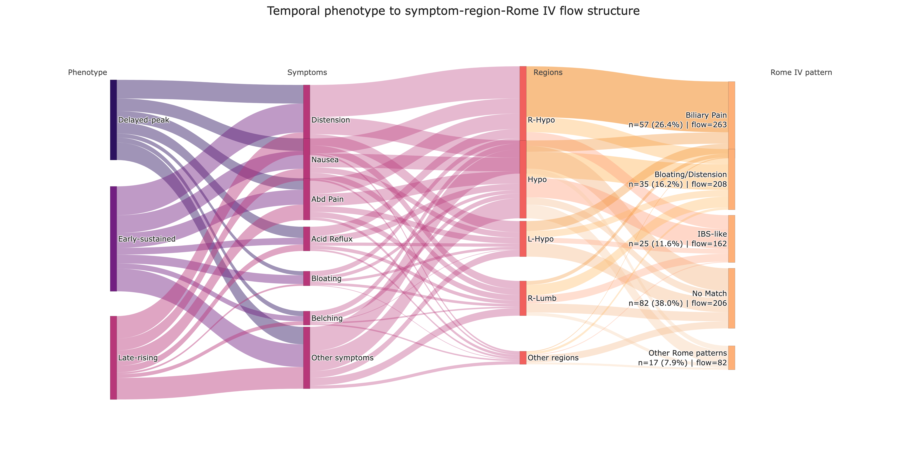

# Supplementary Appendix

**Supplementary Material for:** "Temporal Dynamics and Phenotypic Heterogeneity in Oral Capsaicin-Induced Human Visceral Pain"

This appendix provides expanded methods, supplementary diagnostics, and supporting figures and tables that are not shown directly in the composite main-text figures.

This appendix includes Supplementary Methods S1-S3, Figures S1-S5, and Tables S1-S4, with Tables S2b and S2c reported as supplementary network extensions.

Citation numbers in this appendix follow the main manuscript reference list.

## Supplementary Methods

### S1. Early-window temporal phenotype classification

The early-window analysis treated phenotype classification as a subject-level prediction task. The baseline-only matrix matched the baseline-plus-physiology matrix used in the main phenotype-prediction analysis and included demographic variables, questionnaire-derived exposure-history and symptom variables, and electrocardiographic (ECG), electrogastrographic (EGG), and ECG-EGG coupling features. Additional matrices appended the first 3, 5, 8, or 20 minutes of post-capsaicin visual analog scale (VAS) data.

For each early window, predictors included the raw minute-level VAS values and derived summary variables: mean, minimum, maximum, last value, prefix area under the curve, range, linear slope, early delta, and within-prefix peak time. Values marked `E` or `T` were treated as censored; once either marker appeared, all later VAS values for that participant were set to missing before feature extraction.

Candidate classifiers included sparse logistic regression, standard logistic regression, radial and linear support vector machines, ridge classification, k-nearest neighbors, random forest, extra trees, histogram-based gradient boosting, and Gaussian naive Bayes. Stratified ten-fold cross-validation generated out-of-fold accuracy, balanced accuracy, macro F1, and weighted F1.

This prefix-based design restricted each model to information available up to the evaluated minute. The analysis therefore tested when trajectory information became sufficiently informative to distinguish delayed-peak, early-sustained, and late-rising response patterns, rather than how well the full trajectory could be reconstructed retrospectively.

### S2. ECG/EGG preprocessing and feature derivation

The physiology feature set was generated from raw ECG and EGG recordings using a standardized preprocessing pipeline. Both signal streams were treated as 250 Hz recordings. ECG preprocessing selected the first non-flat channel when multiple leads were available, flagged flat-line segments, saturation-like outliers, and abrupt jumps, and summarized the proportion of flagged samples as an artifact ratio.

The selected ECG lead was band-pass filtered with a fourth-order Butterworth filter from 0.5 to 40 Hz and a 50-Hz notch filter. R peaks were detected with two complementary algorithms, a Pan-Tompkins-style detector and an amplitude-threshold peak finder, and detections were merged within an 80-ms tolerance. RR intervals were then edited when they fell outside 300 to 2,000 ms, changed by more than 25% from adjacent intervals, or deviated markedly from a local median trend; when sufficient neighboring intervals remained, edited values were replaced by linear interpolation. An ECG signal quality index (SQI; 0-100) combined artifact coverage, agreement between the two R-peak detectors, RR edit ratio, and high-frequency noise burden. ECG traces with SQI >=40 were retained for heart-rate summaries, and traces with SQI >=60 were retained for HRV summaries.

EGG preprocessing first evaluated each available channel separately. For multichannel recordings, each channel was downsampled to 4 Hz for quality assessment, detrended, screened for slow-wave artifacts, and assigned a channel-level SQI. The retained EGG signal was formed as a quality-weighted combination of channels when stable weights were available, or as the highest-scoring single channel otherwise. The combined EGG signal was then downsampled to 4 Hz, screened again for artifacts, and filtered with second-order Butterworth filters into a broad gastric band (0.0083-0.15 Hz) and a normogastric band (0.033-0.067 Hz). Additional SQI components quantified gastric spectral focus, spectral prominence, low-frequency drift, and ECG contamination estimated around ECG R peaks. EGG traces with SQI >=40 were retained for feature extraction.

Extracted ECG features included heart-rate and heart-rate-variability (HRV) summaries, time-domain HRV measures (SDNN, RMSSD, pNN50, pNN20, CVSD), frequency-domain HRV measures (LF power, HF power, LF/HF ratio, LFnu, HFnu), Poincare indices (SD1, SD2, SD1/SD2 ratio), and ECG quality metrics. Extracted EGG features included dominant, mean, and median frequency; dominant and total power; bradygastria, normogastria, and tachygastria power proportions; a normogastria-to-abnormal power ratio; spectral entropy; spectral flatness; dominant-frequency instability; signal energy; root-mean-square amplitude; and EGG quality metrics. ECG-EGG coupling features included heart rate-EGG correlation, maximal cross-correlation and its lag, mean coherence within 0.01 to 0.10 Hz, and an ECG-to-EGG energy ratio.

### S3. Expanded baseline-plus-physiology phenotype prediction

The baseline phenotype-prediction matrix combined demographic variables, questionnaire-derived exposure-history and symptom variables, ECG features, EGG features, and ECG-EGG coupling features. Questionnaire-derived variables included age, sex, body mass index, height, weight, alcohol consumption, spicy food frequency, usual spiciness level, spicy food preference, maximum tolerable spiciness, Chronic Capsaicin Exposure Index (CCEI), Acute Exposure Score (AES), recent spicy food intake, time since last spicy intake, spicy episodes in the previous 24 hours, baseline gastrointestinal symptom burden, and time since last meal.

ECG-derived variables included heart-rate-variability and signal-quality measures. EGG-derived variables included dominant frequency, power, rhythm-band proportions, entropy, flatness, instability, and signal-quality indices. ECG-EGG coupling variables included cross-correlation, lag, coherence, energy ratio, and heart rate-EGG correlation summaries. Missing values were imputed with column medians.

The primary model set included class-balanced logistic regression, class-balanced random forest, gradient boosting, histogram-based gradient boosting, multilayer perceptron with early stopping, and a stacking ensemble. Stratified ten-fold cross-validation estimated model performance, with balanced accuracy and macro F1 as the primary metrics. A complementary classifier family used the same encoded matrix to generate supplementary feature-importance and confusion-matrix summaries.

These analyses asked whether pre-exposure trait-like information could predict temporal phenotype membership without access to the evolving pain trajectory. The resulting matrix should be interpreted as a heterogeneous baseline descriptor set rather than a mechanistically unified biomarker panel. Accordingly, the supplementary feature-importance outputs identify variables that contributed within fitted models; they do not establish stable markers or causal determinants of phenotype membership.

## Supplementary Results

The following sections retain analyses that extend, rather than duplicate, the main-text composite figures.

### S4. Additional baseline-plus-physiology phenotype summaries

**Figure S1. Age by Phenotype.**

*Caption:* Age distributions stratified by temporal phenotype.

Age distributions overlapped across delayed-peak, early-sustained, and late-rising phenotypes, with no phenotype showing a clearly separated age profile. This visual pattern is consistent with the broader baseline-prediction result, in which age alone did not materially organize the temporal phenotypes identified in this cohort.

**Figure S2. Standardized ECG/EGG Feature Distributions.**

*Caption:* Standardized ECG and EGG feature distributions across temporal phenotypes for representative baseline physiological features. Abbreviations: ECG, electrocardiographic; EGG, electrogastrographic; HR, heart rate; SDNN, standard deviation of normal-to-normal intervals; LF/HF, low-frequency/high-frequency power ratio; normogastria, EGG power proportion within the normogastric frequency band.

Feature distributions showed partial between-phenotype separation, but substantial overlap persisted across most variables. The representative ECG and EGG features shown here therefore illustrate limited group-level shifts rather than clear baseline physiological separation, consistent with the modest baseline-plus-physiology prediction performance reported in the main text.

### S5. Local temporal motifs

**Figure S3. Cluster-specific shapelets.**

*Caption:* Sub-figures are arranged by phenotype in rows and by shapelet rank in columns. Each panel shows one cluster-discriminative shapelet, defined here as a short trajectory subsequence that helps distinguish one phenotype from the others. The solid line marks the highlighted shapelet, the dashed line shows the full source trajectory, and the shaded region marks the post-capsaicin time window spanned by the shapelet. AUC denotes the one-vs-rest area under the receiver operating characteristic curve, `d` denotes Cohen's d effect size, and `t` denotes the post-capsaicin time window in minutes.

Delayed-peak responders showed motifs with deferred maxima followed by decline, early-sustained responders showed plateau-like motifs, and late-rising responders showed gradual upward fragments. These local motifs help explain why DTW-based clustering separated the phenotypes even when full-length trajectories overlapped in absolute intensity at some time points. Part of the phenotype signal was therefore embedded in short contiguous subsequences rather than only in global peak value or total pain burden.

### S6. Symptom-region and Rome IV-informed supplementary visualizations

**Table S1. Top Symptom-Region Associations of the Overall Symptom-Region Network**

| Symptom | Region | Weight |
|:--|:--|--:|
| abdominal distension | right hypochondrium | 110 |
| abdominal distension | hypogastrium | 59 |
| abdominal pain | right hypochondrium | 53 |
| nausea | right hypochondrium | 52 |
| nausea | hypogastrium | 47 |

**Table S2. Top Network Nodes of the Overall Symptom-Region Network**

| Node | Type | Degree | Weighted Degree |
|:--|:--|--:|--:|
| right hypochondrium | region | 12 | 368 |
| hypogastrium | region | 12 | 267 |
| abdominal distension | symptom | 8 | 240 |
| nausea | symptom | 9 | 145 |
| abdominal pain | symptom | 7 | 143 |

**Table S2b. Top Region-Disease Associations**

| Region | Disease | Weight |
|:--|:--|--:|
| right hypochondrium | Biliary Pain-like | 86 |
| hypogastrium | Functional Abdominal Bloating/Distension-like | 63 |
| right hypochondrium | Functional Abdominal Bloating/Distension-like | 39 |
| hypogastrium | Biliary Pain-like | 38 |
| hypogastrium | Irritable Bowel Syndrome-like | 23 |
| left hypochondrium | Biliary Pain-like | 22 |
| hypogastrium | Unspecified Functional GI Symptom Pattern | 21 |
| right lumbar | Functional Abdominal Bloating/Distension-like | 20 |
| right hypochondrium | Irritable Bowel Syndrome-like | 17 |
| right lumbar | Biliary Pain-like | 14 |

**Table S2c. Top Symptom-Disease Associations**

| Symptom | Disease | Weight |
|:--|:--|--:|
| abdominal distension | Biliary Pain-like | 61 |
| abdominal distension | Functional Abdominal Bloating/Distension-like | 60 |
| abdominal pain | Biliary Pain-like | 53 |
| nausea | Biliary Pain-like | 52 |
| nausea | Functional Abdominal Bloating/Distension-like | 35 |
| abdominal pain | Irritable Bowel Syndrome-like | 28 |
| abdominal distension | Irritable Bowel Syndrome-like | 26 |
| acid regurgitation | Biliary Pain-like | 21 |
| abdominal pain | Functional Abdominal Bloating/Distension-like | 21 |
| vomiting | Biliary Pain-like | 17 |

Tables S1 and S2 complement the heatmaps by identifying the symptom-region pairs and nodes that accounted for the strongest recurrent structure. The right hypochondrium and hypogastrium stood out because they combined broad connectivity with high recurrence, whereas abdominal distension ranked highly as a symptom hub that bridged multiple regions rather than remaining confined to a single location.

Tables S2b and S2c extend this summary into the Rome IV-informed layer. Region-disease links concentrated mainly around biliary pain-like and bloating/distension-like patterns, and symptom-disease links were driven primarily by abdominal distension, abdominal pain, and nausea. Degree reflects the breadth of a node's participation across pairings, whereas weighted degree reflects how often those pairings recurred in the cohort. Together, these rankings indicate that the dominant network signal arose from a limited set of recurrent hubs rather than from a diffuse distribution across all possible symptom-region or symptom-pattern combinations.

**Figure S4. Temporal phenotype to symptom-region-Rome IV flow structure.**

*Caption:* Flow widths represent participant-level symptom-region co-occurrence counts expanded within each temporal phenotype and linked to each participant's top Rome IV-informed category. To preserve readability, lower-frequency symptoms, regions, and Rome-pattern categories were grouped into `Other` nodes. Rome-pattern labels report participant-level `n (%)` together with flow counts. Label abbreviations: `Abd Pain`, abdominal pain; `R-Hypo`, right hypochondrium; `Hypo`, hypogastrium; `L-Hypo`, left hypochondrium; `R-Lumb`, right lumbar; `IBS-like`, irritable bowel syndrome-like. `Biliary Pain` and `Bloating/Distension` are shortened display labels for the corresponding Rome IV-informed symptom-pattern alignments. `No Match` indicates that no Rome IV-informed category was assigned by the rule-based mapping.

The Sankey view shows that the temporal phenotypes differed in trajectory shape while still converging on a limited set of symptom, region, and Rome IV-informed pathways. Across phenotypes, abdominal distension, nausea, and abdominal pain contributed prominently, and downstream flow remained concentrated in the right hypochondrium, hypogastrium, biliary pain-like, bloating/distension-like, and irritable bowel syndrome-like pathways. The sizable `No Match` branch further indicates that the conservative rule-based mapping left many participant symptom profiles uncategorized.

### S7. Short-term VAS direction prediction

**Table S3. Performance of Short-Term Direction Prediction Models**

| Model | Accuracy (mean +/- SD) | Balanced Accuracy | Macro F1 | Weighted F1 |
|:--|:--|:--|:--|:--|
| Majority | 0.717 +/- 0.016 | 0.500 +/- 0.000 | 0.418 +/- 0.005 | 0.599 +/- 0.021 |
| Persistence-direction | 0.579 +/- 0.032 | 0.531 +/- 0.025 | 0.523 +/- 0.025 | 0.594 +/- 0.031 |
| Logistic regression | 0.659 +/- 0.011 | 0.654 +/- 0.016 | 0.626 +/- 0.012 | 0.674 +/- 0.010 |

Abbreviations: SD, standard deviation; F1, harmonic mean of precision and recall; Macro F1, unweighted mean of class-specific F1 scores; Weighted F1, support-weighted mean of class-specific F1 scores. The persistence-direction model predicts decrease when the current local slope is sufficiently negative and otherwise predicts non-decrease.

The majority baseline achieved the highest raw accuracy but balanced accuracy of 0.500, indicating limited class-balanced discrimination despite favorable performance on the majority class. By contrast, logistic regression achieved the strongest class-balanced performance, with the highest balanced accuracy, macro F1, and weighted F1 among the three models. Table S3 is retained here because it provides the metric breakdown summarized graphically in the main manuscript.

### S8. Complementary classifier diagnostics

**Figure S5. Complementary Phenotype-Classification Random Forest Feature Importance.**

*Caption:* Random forest feature-importance values from the complementary baseline-plus-physiology phenotype-classification analysis. Horizontal bars show the top-ranked predictors and their model-specific importance values. Abbreviations: CCEI, Chronic Capsaicin Exposure Index; AES, Acute Exposure Score; ECG, electrocardiographic; EGG, electrogastrographic; HR, heart rate; SQI, signal quality index.

The highest-ranked variables were dominated by questionnaire-derived exposure and preference measures, including CCEI, spicy food preference, AES, usual spiciness level, time since last spicy intake, and spicy food frequency, together with a smaller subset of physiology-derived variables such as ECG artifact ratio, ECG-EGG coherence, EGG signal quality, and heart rate-EGG correlation.

These rankings indicate which predictors contributed most within this fitted model family. They are model-specific importance scores and should not be interpreted as stable standalone markers or causal determinants of phenotype membership.

### S9. Safety

**Table S4. Summary of Adverse Events**

| Safety outcome | Number of participants | Percentage |
|:--|--:|:--|
| Any adverse event | 9 | 4.2% |
| Serious adverse event | 0 | 0.0% |
| Medical intervention required | 0 | 0.0% |
| Protocol discontinuation due to adverse event | 9 | 4.2% |
| Hospitalization | 0 | 0.0% |

Nine participants (4.2%) experienced T-coded adverse events that ended the trial early. No serious adverse events, medical interventions, or hospitalizations were recorded, and all reported symptoms resolved within 30 minutes.

### S10. Short supplementary interpretation

The retained supplementary materials extend the main manuscript by providing analytic detail, supplementary diagnostics, and additional network summaries without repeating the composite main-text panels. Supplementary Methods S1-S3 document the early-window classification design, the ECG/EGG preprocessing and feature-derivation workflow, and the expanded baseline-plus-physiology prediction framework.

Figures S1 and S2 indicate that age and baseline physiology contained some between-phenotype structure, but not enough to classify temporal phenotypes with high accuracy from pre-exposure information alone. Figure S3 shows that cluster-discriminative local motifs were embedded in short subsequences of the VAS trajectories, whereas Tables S1, S2, S2b, and S2c and Figure S4 show that symptom-region and Rome IV-informed structure was concentrated around recurrent hubs rather than dispersed evenly across the cohort.

Table S3, Figure S5, and Table S4 define the interpretive boundaries of short-horizon forecasting, model-specific feature attribution, and safety. Taken together, the appendix supports the main manuscript by clarifying how the temporal phenotypes, symptom-pattern structure, and predictive analyses were derived and by making the supporting evidence easier to evaluate independently.
